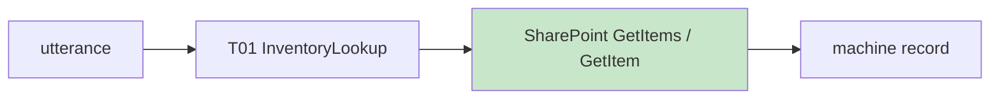
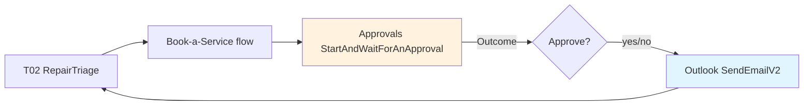
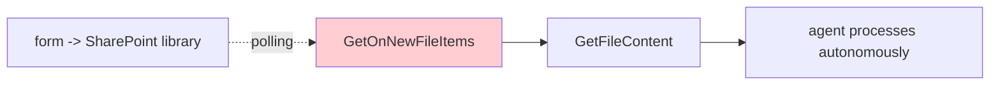

# Quick-Win Triggers and Descriptions

Two ways an agent decides what to do, and you author for both:

- **Generative orchestration (default):** the agent picks a topic, tool, or knowledge source by reading its **description**. Here you write sharp `modelDescription` text.
- **Classic orchestration (deterministic fallback):** the agent matches the user utterance to **trigger phrases**. Here you write 5 to 10 example utterances per topic.

Microsoft guidance: 5 to 10 trigger phrases per topic is the sweet spot. More is not better; variety of phrasing beats volume.

---

## Topic: Inventory Lookup (`T01_InventoryLookup`)

**Model description (generative):**
> Handles questions about which pinball machines Contoso has in stock, their price, manufacturer, year, condition, and availability, including comparisons between two machines. Grounds answers in the inventory catalog.

**Trigger phrases (classic fallback):**
- do you have Medieval Madness
- is the Godzilla Premium in stock
- what pinball machines do you have
- how much is the Twilight Zone
- check availability
- any Stern machines available
- price of Attack from Mars
- what's your cheapest machine

---

## Topic: Repair Triage (`T02_RepairTriage`)

**Model description (generative):**
> Triages a reported problem with a pinball machine (weak flipper, stuck ball, flickering display, no power, no scoring, audio fault), gives safe first-line checks from the repair playbook, and offers to book a service visit. Does not quote firm prices; hands off to the quote flow.

**Trigger phrases (classic fallback):**
- my flipper is weak
- pinball won't start
- ball keeps getting stuck
- display is flickering
- machine needs repair
- book a service appointment
- troubleshoot my pinball
- no sound coming from my machine

---

## Easy additional topics worth stubbing (each a clean win)

These are low-effort, high-payoff topics that round out the agent. Each is a "quick win" because it grounds in docs you already have.

| Topic idea | Model description (generative) | Sample trigger phrases |
|-----------|--------------------------------|------------------------|
| **Machine Research** | Answers history and background questions about a machine: designer, era, significance, features. Grounds in the history/research source. | "who made Attack from Mars", "what era is Black Knight", "tell me about Twilight Zone", "history of Medieval Madness" |
| **Warranty and Services** | Explains warranty coverage, service tiers, price bands, turnaround, delivery, trade-ins. | "what does the warranty cover", "how much is a flipper repair", "how long does service take", "do you take trade-ins" |
| **Compare Two Machines** | Compares two showroom titles on price, era, condition, and play style. | "compare Medieval Madness and Attack from Mars", "which is better Godzilla or Jaws", "cheaper than the Twilight Zone" |
| **Store Info and Hours** | Static facts: hours, location, pickup, contact. A good candidate for a simple deterministic message topic. | "what are your hours", "where are you located", "can I pick up locally" |

---

## Connector wiring — live reference card

Go-time schematic. `*` = required. All grounded (Outlook/SharePoint from connector-lookup; Excel/Approvals from Microsoft Learn connector reference). All four connectors are **Standard tier, no premium license**.

**Wiring matrix**

| Topic | Connector | API name | operationId | Where it runs |
|-------|-----------|----------|-------------|---------------|
| T01 Inventory | **SharePoint** | `shared_sharepointonline` | `GetItems` / `GetItem` | Topic action |
| T01 alt | Excel Online (Business) | `shared_excelonlinebusiness` | `GetItems` / `GetItem` / `GetTables` | Topic action |
| T02 Approval | **Standard approvals** | `shared_approvals` | `StartAndWaitForAnApproval` | **Power Automate flow** |
| T02 Email | **Office 365 Outlook** | `shared_office365` | `SendEmailV2` | Topic action or flow |
| T03 Intake | **SharePoint** | `shared_sharepointonline` | `GetOnNewFileItems` / `GetOnNewItems` | **Autonomous flow** |

**Connection mode** (`action.connectionProperties.mode`): `Maker` = maker's creds (shared inventory reads). `Invoker` = end-user's creds (permission-scoped actions).

---

### T01 Inventory Lookup



```text
GetItems  ·  SharePoint (shared_sharepointonline)  ·  Entra OAuth  ·  PRIMARY
  IN   dataset*   Site Address    https://contoso.sharepoint.com/sites/PinballGallery
       table*     List Name       CPG Inventory Machines
       $filter    Filter Query    Title eq 'Medieval Madness'  |  SKU eq 'MM-1997'
       $orderby   Order By        PriceUsd desc
       $top       Top Count
       view       Limit by View   pin one to dodge the lookup-column cap
  OUT  Title SKU Manufacturer ModelYear ConditionGrade PriceUsd Availability
       Location WarrantyDays HoldExpiresUtc Featured Tags Notes
  ⚠   >12 lookup cols fails -> pin a view  ·  generic lists (template 100) only

GetItem   ·  same connector  ·  single row
  IN   dataset*  ·  table*  ·  id* (Number, list item Id)  ·  view
```

```text
GetItems / GetItem  ·  Excel Online (Business) (shared_excelonlinebusiness)  ·  ALT (weaker)
  IN   source*  Location    me | site URL       drive*  Document Library
       file*    the .xlsx   table*  named table (e.g. InventoryMachines)
       $filter $orderby $top $skip $select      GetItem adds: idColumn* (case-sensitive), id*
  ⚠   256 rows default -> needs pagination  ·  read needs WRITE access (else 403/502)
      no concurrent writers, lock up to 6 min  ·  file 25MB / req 5MB / 100 calls per 60s
  Discover tables: GetTables -> value[].id, value[].name
```

**Why SharePoint wins:** matches the seeded lists in `inventory-flow-data-dictionary.md`, no file-lock fragility. **Dataverse** is the scale-up (List rows / Get a row by ID) if you need relationships and option sets.

---

### T02 Repair Triage → Book-a-Service



```text
StartAndWaitForAnApproval  ·  Standard approvals (shared_approvals)  ·  RUNS IN A FLOW, not a topic
  IN   approvalType*   Approve/Reject - First to respond | Everyone must approve | sequential
       WebhookApprovalCreationInput*  (dynamic body):
         title*        Book-a-Service visit for Medieval Madness (SKU MM-1997)
         assignedTo*   manager UPN/email/objectId  (semicolon = multiple)
         details       markdown OK
         itemLink requestor enableNotifications enableReassignment
  OUT  outcome  responseSummary  completionDate
       responses[].responder.{displayName,email,userPrincipalName}
       responses[].approverResponse  ("Approve"/"Reject", case-sensitive)  ·  .comments
  ⚠   records stored in Dataverse (env needs it)  ·  timestamps UTC  ·  sender = flow creator
      50 creates per 60s

  FLOW SHAPE:  [Run a flow from Copilot Studio] -> StartAndWaitForAnApproval
               -> branch on Outcome -> return outputs to topic
```

```text
SendEmailV2  ·  Office 365 Outlook (shared_office365)  ·  OAuth on sender mailbox
  IN   To*  (semicolon)   Subject*   Body*
       Cc Bcc  ·  From (needs Send-as)  ·  Attachments[] (Name + ContentBytes)
       Importance Sensitivity ReplyTo
  where  put inside the flow (reads Outcome + comments); can also be a direct topic action
```

*Lightweight variant, do not use for course: Outlook `SendApprovalMail` (actionable email, returns subscription id, no Dataverse audit). Use the real Approvals connector, it is the sell-page pattern.*

---

### T03 Autonomous repair-intake (Segment 3 event)



```text
GetOnNewFileItems  ·  SharePoint (shared_sharepointonline)  ·  AUTONOMOUS FLOW trigger
  IN   dataset*  Site Address   table*  Library Name   folderPath  Folder   view
  OUT  file properties incl. file identifier -> chain GetFileContent to read the form
GetOnNewItems  ·  same connector  ·  use if intake is a LIST ITEM not a file
  IN   dataset*  ·  table* (List Name)  ·  view
  ⚠   deprecated: OnNewFile ("When a file is created in a folder") -> use GetOnNewFileItems

REQUIREMENTS (Segment 3 load-bearing):
  · GenerativeActionsEnabled: true   (event triggers dead under classic orchestration)
  · trigger lives on a Power Automate flow attached as autonomous trigger, NOT a topic
  · billing: autonomous runs consume capacity SEPARATELY -> Segment 4 ROI tile
  · latency: polling, minutes not instant  ·  scope: libraries (101) / lists (100) only
  · YAML limit: trigger + flow live OUTSIDE .mcs.yml; only the processing topic is authorable
```

---

## Authoring notes (the why)

- **Front-load nouns.** Trigger phrases and descriptions should carry the words a customer actually says: machine names, "price," "repair," "warranty." That is what the NLU and semantic retrieval anchor on.
- **Do not overlap topics.** If two topics both claim "repair" phrasing, the agent shows a "did you mean" disambiguation. Keep each topic's phrases distinct.
- **Descriptions are the contract in generative mode.** A weak `modelDescription` is the number-one cause of the wrong topic firing. Spend the words there, not on adding a 20th trigger phrase.
