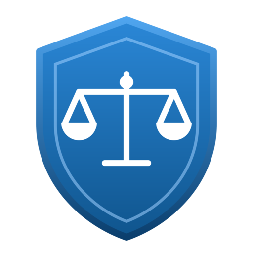

# RAI Advisor -- Responsible AI Agent



A deployable **Copilot Studio** agent that advises on Microsoft's six **Responsible AI (RAI)** principles and, more importantly, on how to **operationalize** them: running Responsible AI Impact Assessments, drafting Transparency Notes, configuring content moderation, and evaluating agents for harms. Built for the O'Reilly course **"How to Create AI Agents Like a Pro"** (Hour 2, Low-Code Agents). Schema sibling of `CKA Exam Prep Assistant/`.

## Overview

RAI Advisor is an **advisor that produces governance artifacts**, not a definitions bot. It is grounded in current (June 2026) Microsoft Responsible AI documentation and carries verified hard facts in its system prompt so it never drifts on the high-risk details.

| Property | Value |
|----------|-------|
| Format | Deployable `.mcs.yml` (Copilot Studio VS Code extension / Dataverse export) |
| Channels | Microsoft Teams, Microsoft 365 Copilot |
| Orchestration | Generative (GenerativeAIRecognizer) |
| Content moderation | High (responsible default for a harm/safety-adjacent advisor) |
| Knowledge | 3 public Microsoft sources (RAI principles, Copilot Studio RAI, Foundry RAI) |

## Scenario

A maker or architect is shipping an AI system on Microsoft platforms and needs to satisfy their organization's Responsible AI process. Instead of reading scattered docs, they ask RAI Advisor to explain a principle, generate an Impact Assessment for their system, draft a Transparency Note, fix a content-moderation problem, or plan a harm evaluation. The agent returns structured, source-cited guidance and -- for the Impact Assessment -- a real document saved to SharePoint.

## Success Metrics

- The agent explains all **six** principles with Microsoft's exact wording and never miscounts them as eight.
- The Impact Assessment workflow produces a structured document mapped to the **17 goals** of the Responsible AI Standard v2 (never 14) and returns a SharePoint link.
- Content-moderation guidance correctly distinguishes the **three moderation scopes** and the per-prompt slider's **February 11, 2026 GA**.
- Every substantive answer cites a Microsoft source URL.

## Verified Hard Facts (baked into the agent)

These are non-negotiable grounding facts, fact-checked against current Microsoft Learn sources. They live in `agent.mcs.yml` and `docs/rai-advisor-system-prompt.xml`.

- **Six principles, not eight.** Fairness; Reliability & Safety; Privacy & Security; Inclusiveness; Transparency; Accountability. The ampersand groupings are deliberate. Source: <https://www.microsoft.com/ai/principles-and-approach>
- **The Responsible AI Standard v2 (June 2022) has 17 goals, not 14.** One stale Microsoft Learn article says 14; the v2 PDF documents 17. Source: <https://aka.ms/RAI>
- **Three content-moderation scopes.** Agent and topic levels use Lowest->Highest (default High); the per-prompt slider uses Low/Moderate/High (default Moderate), is managed-models-only, and went GA February 11, 2026. Source: <https://learn.microsoft.com/microsoft-copilot-studio/knowledge-copilot-studio#content-moderation>
- **Silently blocked answers** have no user-facing message and are only visible via Application Insights KQL.
- *Teaching framing, not a sourced fact:* Microsoft has historically highlighted Transparency and Accountability as cross-cutting principles that reinforce the other four. No current Microsoft page asserts this, so the agent presents it as framing, not truth.

## Phased Build

### Phase 1 -- Import the agent

1. Open the `RAI Advisor/` folder in VS Code with the **Copilot Studio extension** (GA, January 2026).
2. Confirm the Problems pane is clean (the only validator notices are benign: `settings.mcs.yml` and `connectionreferences.mcs.yml` legitimately have no root `kind`, identical to the CKA reference).
3. Push to your environment, then **publish** (a push alone will not make the live demo work -- test tools only reach published content).

### Phase 2 -- Attach the Impact Assessment workflow

Follow `docs/impact-assessment-workflow-guide.md` (about 20 minutes):

1. Create the SharePoint `RAI Impact Assessments` folder.
2. Build the flow from `docs/impact-assessment-flow-bootstrap-prompt.md`.
3. Attach the flow to the agent and swap the `T02_ImpactAssessment` inline placeholder for the real flow call.
4. Sync the populated connection reference back into `connectionreferences.mcs.yml`.

### Phase 3 -- Set the icons

- `icon.png` -- agent avatar (shield + balance scales, transparent background).
- `store-icon.png` -- Teams / M365 store color icon (192x192).

## Topic Catalog

| Topic | Trigger examples | What it does |
|-------|-----------------|--------------|
| `T01_PrinciplesExplainer` | "what are the responsible AI principles" | Six principles as a Markdown table with exact definitions |
| `T02_ImpactAssessment` | "run an impact assessment" | Collects system details, generates an Impact Assessment, returns a SharePoint link |
| `T03_TransparencyNote` | "draft a transparency note" | Drafts a Microsoft-style Transparency Note |
| `T04_ContentModerationGuide` | "why are my answers being blocked" | The three moderation scopes + KQL diagnosis |
| `T05_HarmEvaluation` | "how do I evaluate my agent for harms" | Discover -> Protect -> Govern walkthrough |

Plus the standard system topics (ConversationStart, Greeting, Goodbye, ThankYou, Escalate, Fallback, OnError, Signin, StartOver, ResetConversation, EndofConversation, MultipleTopicsMatched) and a `Search` conversational-boosting topic over the RAI knowledge sources.

## Knowledge Sources

| Source | Site |
|--------|------|
| Microsoft Responsible AI | <https://www.microsoft.com/ai/responsible-ai> |
| Copilot Studio Responsible AI | <https://learn.microsoft.com/microsoft-copilot-studio/responsible-ai-overview> |
| Azure AI Foundry Responsible AI | <https://learn.microsoft.com/azure/foundry/responsible-use-of-ai-overview> |

## Testing Matrix

| Test utterance | Expected behavior |
|----------------|-------------------|
| `what are the six RAI principles` | Markdown table, six principles, exact definitions, source cited |
| `run an impact assessment` | Three prompts (name, description, intended use), then assessment + SharePoint link (or inline fallback) |
| `how many goals are in the RAI standard` | Answers 17, never 14 |
| `why did my answer disappear` | Explains content moderation + App Insights KQL diagnosis |
| `draft a transparency note for my chatbot` | Transparency Note following the canonical section pattern |
| (deliberately disallowed prompt) | Declines briefly, redirects to responsible configuration |

## Sample Transcript

> **User:** run an impact assessment
> **RAI Advisor:** I'll run a Responsible AI Impact Assessment. I need three quick details.
> What's the **name** of the AI system?
> **User:** Contoso Returns Bot
> **RAI Advisor:** Briefly **describe** what it does and who uses it.
> **User:** A Teams bot that helps shoppers start product returns.
> **RAI Advisor:** What's the **intended use** and what uses are out of scope?
> **User:** Returns help only. Not for warranty claims or payments.
> **RAI Advisor:** Your Responsible AI Impact Assessment is ready: `https://contoso.sharepoint.com/.../Contoso-Returns-Bot-RAI-Impact-Assessment-20260602.md`
> It covers all six principles, maps to the 17 goals of the Standard v2, and includes a risks-and-mitigations table and a human-oversight section.

## Files

```text
RAI Advisor/
├── README.md
├── agent.mcs.yml                 # GptComponentMetadata + system prompt + hard facts
├── settings.mcs.yml              # channels, generative orchestration, moderation High
├── connectionreferences.mcs.yml  # empty shell until the flow is attached
├── icon.png / icon.svg           # agent avatar (shield + scales)
├── store-icon.png / store-icon.svg  # Teams / M365 store icon
├── docs/
│   ├── rai-advisor-system-prompt.xml          # XML generation prompt
│   ├── impact-assessment-flow-bootstrap-prompt.md  # flow generator prompt
│   └── impact-assessment-workflow-guide.md         # click-by-click build + attach
├── topics/                       # 13 system topics + 5 custom RAI topics
└── knowledge/                    # 3 public Microsoft RAI sources
```

## Authoring note

When editing any `.mcs.yml` in this folder, delegate to the `@copilot-studio:*` sub-agents (author / validate / troubleshoot) -- the repo's SessionStart hook requires it. Component names must never contain periods (breaks solution exports). Re-verify the moving-target facts (per-prompt moderation GA, Foundry guardrail preview status, the Standard version) before each delivery.
