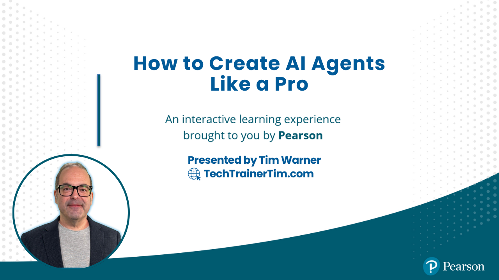
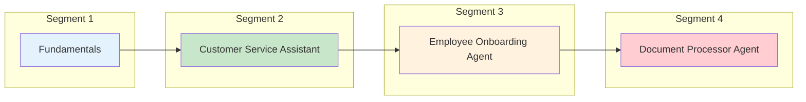

# How to Create AI Agents Like a Pro

[](https://techtrainertim.com) [](https://github.com/timothywarner-org/copilot-memory-store)

**O'Reilly Live Learning Course** | 4 Hours | Microsoft Copilot Studio

Build three production-ready AI agents using Microsoft Copilot Studio's low-code platform. Learn to automate customer service, employee onboarding, and document processing workflows.

## Course Overview



| Segment | Focus | Difficulty | Key Skills |
|---------|-------|------------|------------|
| Segment 1 | Copilot Studio Fundamentals | Intro | Navigation, agent creation, terminology |
| Segment 2 | Customer Service Assistant | Beginner | Topics, knowledge sources, generative answers |
| Segment 3 | Employee Onboarding Agent | Intermediate | Power Automate flows, authentication, approvals |
| Segment 4 | Document Processor Agent | Advanced | Autonomous triggers, AI Builder, event-driven automation |

## Prerequisites

- Microsoft 365 account (Business or Enterprise)
- Copilot Studio access ([start free trial](https://copilotstudio.microsoft.com))
- Microsoft Teams desktop app
- Basic familiarity with Microsoft 365 apps

## Repository Structure

```
agents-pro/
├── README.md                           # This file
├── CODE_OF_CONDUCT.md                  # Community guidelines
├── contributing.md                     # Contribution guide
├── SECURITY.md                         # Security policy
├── LICENSE                             # MIT License
├── images/                             # Course images
├── docs/                               # Documentation
│   ├── course-plan.md                  # Instructor course plan
│   └── PowerPlatform-WAF-for-CopilotStudio-Agents.md
├── reference/                          # Training proposals & marketing
│   ├── how-to-create-ai-agents-like-a-pro-training-proposal.md
│   └── how-to-create-ai-agents-like-a-pro-markdown.md
└── copilot-studio-agents/
    ├── README.md                       # Scaffold overview
    ├── resources.md                    # Microsoft Learn resources
    ├── _labs/                          # Hands-on lab guides
    ├── _topics/                        # Topic blueprint templates
    ├── _automations/                   # Power Automate templates
    ├── customer-service-assistant/     # Segment 2 project
    │   ├── README.md                   # Full tutorial
    │   ├── topics/                     # Topic configurations
    │   ├── actions/                    # Power Automate flows
    │   └── knowledge/                  # Knowledge sources
    ├── employee-onboarding-agent/      # Segment 3 project
    │   ├── README.md
    │   ├── topics/
    │   ├── actions/
    │   └── knowledge/
    └── document-processor-agent/       # Segment 4 project
        ├── README.md
        ├── topics/
        ├── actions/
        └── knowledge/
```

## Quick Start

1. **Clone the repository**
   ```bash
   git clone https://github.com/timothywarner-org/agents-pro.git
   ```

2. **Review Hour 1 materials** in the training proposal

3. **Build agents in order:**
   - [Customer Service Assistant](./copilot-studio-agents/customer-service-assistant/) (Hour 2)
   - [Employee Onboarding Agent](./copilot-studio-agents/employee-onboarding-agent/) (Hour 3)
   - [Document Processor Agent](./copilot-studio-agents/document-processor-agent/) (Hour 4)

## Agent Summaries

### Hour 2: Customer Service Assistant

**Scenario:** Automate tier-one support for Contoso Electronics

**What you'll build:**
- Knowledge-powered FAQ bot
- Generative answers from SharePoint
- Escalation to human agents
- Teams deployment

**Skills:** Topics, triggers, knowledge sources, generative AI

---

### Hour 3: Employee Onboarding Agent

**Scenario:** Streamline new hire onboarding at Contoso

**What you'll build:**
- Authenticated, personalized experience
- IT equipment request workflow
- Policy acknowledgment with signatures
- Benefits enrollment with approvals

**Skills:** Authentication, Power Automate flows, Approvals connector

---

### Hour 4: Document Processor Agent

**Scenario:** Automate document classification and routing

**What you'll build:**
- Autonomous agent (no user interaction)
- Event triggers (SharePoint file creation)
- AI Builder classification
- Multi-destination routing

**Skills:** Autonomous agents, event triggers, AI Builder, exception handling

## Learning Resources

- [Microsoft Copilot Studio Documentation](https://learn.microsoft.com/en-us/microsoft-copilot-studio/)
- [Copilot Studio Agent Academy](https://learn.microsoft.com/en-us/microsoft-copilot-studio)
- [Topic Authoring Best Practices](https://learn.microsoft.com/en-us/microsoft-copilot-studio/guidance/topic-authoring-best-practices)
- [Agent Flows Overview](https://learn.microsoft.com/en-us/microsoft-copilot-studio/flows-overview)
- [Autonomous Agents](https://learn.microsoft.com/en-us/power-platform/release-plan/2024wave2/microsoft-copilot-studio/create-automated-copilots-triggered-events)

## Course Schedule

| Time | Activity |
|------|----------|
| 0:00 - 0:50 | Copilot Studio fundamentals, demo, mini-exercise |
| 0:50 - 1:00 | Q&A + Break |
| 1:00 - 1:50 | Customer Service Assistant hands-on |
| 1:50 - 2:00 | Q&A + Break |
| 2:00 - 2:50 | Employee Onboarding Agent hands-on |
| 2:50 - 3:00 | Q&A + Break |
| 3:00 - 3:50 | Document Processor Agent hands-on |
| 3:50 - 4:00 | Wrap-up, resources, next steps |

## Instructor

**Tim Warner** — Microsoft MVP (Azure AI and Cloud/Datacenter Management), Microsoft Certified Trainer

- [LinkedIn](https://www.linkedin.com/in/timothywarner/)
- [Website](https://techtrainertim.com/)
- [O'Reilly Author Page](https://learning.oreilly.com/search/?query=Tim%20Warner)

## License

MIT License - See [LICENSE](./LICENSE) for details.

---

**Questions?** Open an issue or reach out via the course chat during live sessions.
