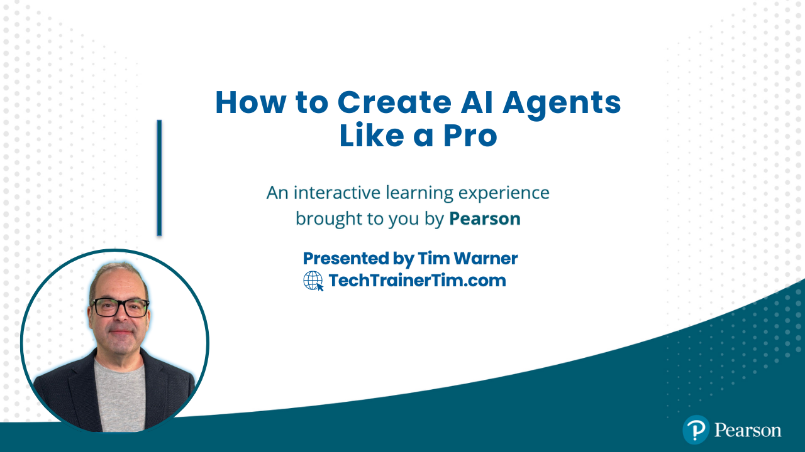

# How to Create AI Agents Like a Pro



[](https://techtrainertim.com) [](https://github.com/timothywarner-org/copilot-memory-store) [](https://github.com/timothywarner-org/prompt-pro)

**O'Reilly Live Learning Course** | 4 Hours | AI Agents -- From Landscape to Code

Build AI agents across the full spectrum -- from declarative M365 Copilot agents and low-code Copilot Studio bots to code-first Python agents with Azure AI Foundry, LangGraph, and FastMCP.

## Course Overview

| Hour | Theme | Key Platforms & Tools |
|------|-------|-----------------------|
| 1 | What "Agent" Means | M365 Copilot agents (custom GPTs), declarative agents, agent landscape taxonomy |
| 2 | Low-Code Agents | Copilot Studio, Antigrav, Claude Code / GitHub Copilot agents |
| 3 | Code-First Agents | Azure AI Foundry agents, Python, LangGraph, FastMCP |
| 4 | TBD | Best practices, MCP deep dive, future trends (finalize before delivery) |

## Prerequisites

- Microsoft 365 account (Business or Enterprise) -- [start free trial](https://www.microsoft.com/en-us/microsoft-365/try)
- Copilot Studio access -- [start free trial](https://copilotstudio.microsoft.com)
- Power Automate Premium -- [start 90-day trial](https://www.microsoft.com/en-us/power-platform/try-free)
- Microsoft Teams desktop app
- Basic familiarity with Microsoft 365 apps

**Hour 3 additionally requires:**

- Python 3.11+ -- <https://www.python.org/downloads/>
- Azure subscription (free tier OK) -- <https://azure.microsoft.com/en-us/free>

**Optional trials for extended scenarios:**

| Resource | URL | Duration |
|----------|-----|----------|
| Power Apps Developer Plan | <https://www.microsoft.com/power-platform/products/power-apps/free> | No limit |
| Azure Free Account | <https://azure.microsoft.com/en-us/free> | 30 days ($200 credit) |
| Power Platform Trials Hub | <https://www.microsoft.com/en-us/power-platform/try-free> | Various |

## Repository Structure

```text
agents-pro/
├── README.md                           # This file
├── CLAUDE.md                           # Claude Code instructions
├── CODE_OF_CONDUCT.md                  # Community guidelines
├── contributing.md                     # Contribution guide
├── SECURITY.md                         # Security policy
├── LICENSE                             # MIT License
├── markdownlint.json                   # Markdown linting config
│
├── .github/                            # GitHub Copilot configurations
│   ├── agents/                         # Copilot agent definitions
│   ├── prompts/                        # Copilot prompt templates
│   └── instructions/                   # Copilot coding instructions
│
├── docs/                               # Documentation & course plan
│
├── images/                             # Course images and assets
│
├── hour-1-agent-landscape/             # Hour 1 — What "Agent" Means
├── hour-2-low-code/                    # Hour 2 — Low-Code Agents
├── hour-3-code-first/                  # Hour 3 — Code-First Agents
├── hour-4-tbd/                         # Hour 4 — TBD
│
└── copilot-studio-agents/              # Copilot Studio content (Hour 2)
    ├── _labs/                          # Hands-on lab guides
    ├── _topics/                        # Topic blueprint conventions
    ├── _automations/                   # Power Automate flow templates
    ├── customer-service-assistant/     # Knowledge-driven FAQ bot
    ├── employee-onboarding-agent/      # Auth, flows, approvals
    └── document-processor-agent/       # Autonomous triggers, AI Builder
```

## Quick Start

1. **Clone the repository**

   ```bash
   git clone https://github.com/timothywarner-org/agents-pro.git
   ```

2. **Hour 1 -- Agent Landscape:** Review the taxonomy and declarative agent demos in `hour-1-agent-landscape/`

3. **Hour 2 -- Low-Code Agents:** Build a Copilot Studio agent and explore Claude Code / GitHub Copilot agent workflows in `hour-2-low-code/`

4. **Hour 3 -- Code-First Agents:** Set up Python 3.11+, create an Azure AI Foundry agent, and wire up LangGraph and FastMCP in `hour-3-code-first/`

5. **Hour 4 -- TBD:** Best practices, MCP deep dive, and future trends in `hour-4-tbd/`

## Hour Summaries

### Hour 1: What "Agent" Means

**Theme:** Orientation and taxonomy

- Agent landscape -- what counts as an "agent" and what does not
- M365 Copilot agents (custom GPTs) and declarative agents
- Where Copilot Studio, Azure AI Foundry, and open-source frameworks fit
- Hands-on: explore a declarative agent inside M365 Copilot

**Skills:** Agent taxonomy, M365 Copilot configuration, declarative agent basics

---

### Hour 2: Low-Code Agents

**Theme:** Build agents without writing code

- Copilot Studio -- topics, triggers, knowledge sources, generative answers
- Antigrav low-code agent builder
- Claude Code and GitHub Copilot as agentic coding assistants
- Hands-on: build and publish a Copilot Studio agent to Teams

**Skills:** Copilot Studio authoring, Power Automate integration, low-code agent patterns

---

### Hour 3: Code-First Agents

**Theme:** Python-based agents with full control

- Azure AI Foundry agents -- deploy and orchestrate from code
- LangGraph -- stateful, multi-step agent graphs
- FastMCP -- lightweight Model Context Protocol servers
- Hands-on: wire an Azure AI Foundry agent to a LangGraph workflow with MCP tools

**Skills:** Python agent development, Azure AI Foundry SDK, LangGraph, FastMCP, MCP

---

### Hour 4: TBD

**Theme:** To be finalized before delivery

- Best practices for production agent deployments
- MCP deep dive -- protocol internals and tool authoring
- Future trends in the agent ecosystem
- Wrap-up exercise: identify three processes to automate next

## Learning Resources

### Hour 1 -- Agent Landscape

- [Microsoft 365 Copilot Hub](https://learn.microsoft.com/en-us/copilot/microsoft-365/)
- [Agents for Microsoft 365 Copilot](https://learn.microsoft.com/en-us/microsoft-365-copilot/extensibility/)
- [Declarative Agents Overview](https://learn.microsoft.com/en-us/microsoft-365-copilot/extensibility/overview-declarative-agent)

### Hour 2 -- Low-Code Agents

- [Copilot Studio Documentation](https://learn.microsoft.com/en-us/microsoft-copilot-studio/)
- [Topic Authoring Best Practices](https://learn.microsoft.com/en-us/microsoft-copilot-studio/guidance/topic-authoring-best-practices)
- [Agent Flows Overview](https://learn.microsoft.com/en-us/microsoft-copilot-studio/flows-overview)
- [Copilot Studio VS Code Extension (Preview)](https://marketplace.visualstudio.com/items?itemName=ms-CopilotStudio.vscode-copilotstudio)

### Hour 3 -- Code-First Agents

- [Azure AI Foundry](https://learn.microsoft.com/en-us/azure/ai-foundry/)
- [LangGraph Documentation](https://langchain-ai.github.io/langgraph/)
- [FastMCP](https://github.com/jlowin/fastmcp)
- [Model Context Protocol](https://modelcontextprotocol.io)
- [Microsoft Agent Framework](https://learn.microsoft.com/en-us/agent-framework/) | [GitHub](https://github.com/microsoft/agent-framework)
- [Microsoft 365 Agents SDK](https://learn.microsoft.com/en-us/microsoft-365/agents-sdk/)

### Hour 4 -- Best Practices & MCP

- [MCP Documentation](https://modelcontextprotocol.io)
- [MCP GitHub](https://github.com/modelcontextprotocol)

### Certifications

- [MS-4004: M365 Copilot Use Cases](https://learn.microsoft.com/en-us/training/courses/ms-4004)
- [AI-102: Azure AI Engineer Associate](https://learn.microsoft.com/en-us/credentials/certifications/azure-ai-engineer/)
- [Copilot & Agent Administration Fundamentals](https://learn.microsoft.com/en-us/credentials/certifications/copilot-and-agent-administration-fundamentals/)

## Course Schedule

| Time | Activity |
|------|----------|
| 0:00 - 0:50 | Hour 1: What "Agent" Means -- taxonomy, M365 Copilot agents, declarative agents |
| 0:50 - 1:00 | Q&A + Break |
| 1:00 - 1:50 | Hour 2: Low-Code Agents -- Copilot Studio, Antigrav, Claude Code / GitHub Copilot |
| 1:50 - 2:00 | Q&A + Break |
| 2:00 - 2:50 | Hour 3: Code-First Agents -- Azure AI Foundry, Python, LangGraph, FastMCP |
| 2:50 - 3:00 | Q&A + Break |
| 3:00 - 3:50 | Hour 4: TBD -- best practices, MCP deep dive, future trends |
| 3:50 - 4:00 | Wrap-up, resources, next steps |

## Instructor

**Tim Warner** -- Microsoft MVP (Azure AI and Cloud/Datacenter Management), Microsoft Certified Trainer

- [LinkedIn](https://www.linkedin.com/in/timothywarner/)
- [Website](https://techtrainertim.com/)
- [O'Reilly Author Page](https://learning.oreilly.com/search/?query=Tim%20Warner)

## License

MIT License - See [LICENSE](./LICENSE) for details.

---

**Questions?** Open an issue or reach out via the course chat during live sessions.
