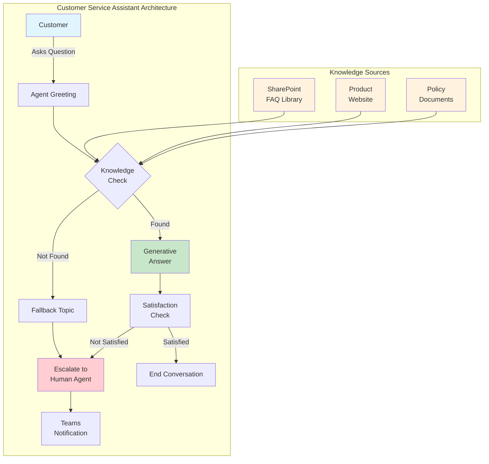
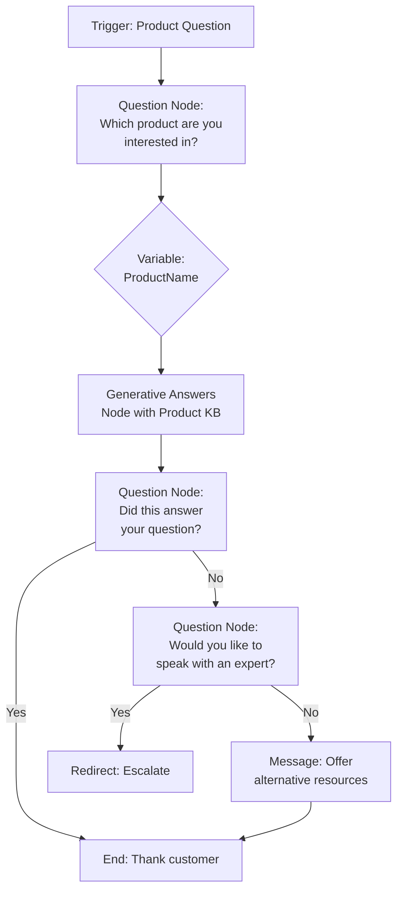
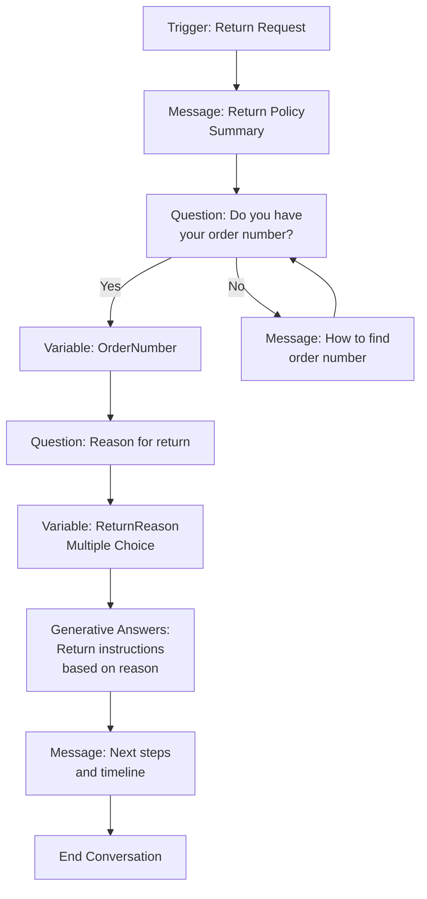

# Customer Service Assistant Agent

**Course Segment:** Hour 2 — Building Your First Knowledge-Powered Agent
**Difficulty:** Beginner
**Estimated Build Time:** 45-50 minutes

## Overview

The Customer Service Assistant is a conversational AI agent designed to handle tier-one support inquiries for a fictional company, **Contoso Electronics**. This agent demonstrates the fundamentals of Microsoft Copilot Studio: topic authoring, knowledge source integration, and generative answers.



## Learning Objectives

By completing this project, participants will:

1. Create an agent using natural language descriptions
2. Configure SharePoint and website knowledge sources
3. Understand how generative answers work with enterprise data
4. Author custom topics with trigger phrases
5. Test conversations in the Copilot Studio simulator
6. Publish the agent to Microsoft Teams

## Prerequisites

- Microsoft 365 account with Copilot Studio access
- SharePoint site with a document library (provided)
- Basic familiarity with conversational interfaces

---

## Scenario: Contoso Electronics Support

**Business Context:** Contoso Electronics receives 500+ support inquiries daily. 60% of these are repetitive questions about:
- Product specifications and compatibility
- Return and refund policies
- Order status and shipping
- Warranty information
- Account and login issues

**Goal:** Automate tier-one support to reduce agent workload by 40% while maintaining customer satisfaction above 85%.

**Success Metrics:**
| Metric | Target | Measurement |
|--------|--------|-------------|
| Resolution Rate | 60%+ | % of conversations resolved without escalation |
| Customer Satisfaction | 85%+ | Post-chat survey rating |
| Avg. Response Time | < 5 seconds | Time to first agent response |
| Escalation Rate | < 40% | % of conversations transferred to human |

---

## Step-by-Step Build Guide

### Phase 1: Create the Agent (10 minutes)

#### Step 1.1: Navigate to Copilot Studio
1. Go to [copilotstudio.microsoft.com](https://copilotstudio.microsoft.com)
2. Sign in with your Microsoft 365 credentials
3. Select the appropriate environment (Development recommended)

#### Step 1.2: Create New Agent
1. Click **+ Create** in the left navigation
2. Select **New agent**
3. Use natural language to describe the agent:

```
Create a customer service assistant for Contoso Electronics that helps
customers with product questions, order status, returns, and warranty
information. The agent should be friendly and professional, and escalate
to a human agent when it cannot resolve an issue.
```

4. Review the generated configuration:
   - **Name:** Contoso Customer Service Assistant
   - **Description:** Helps customers with product inquiries, orders, and support
   - **Instructions:** (auto-generated based on your description)

5. Click **Create**

#### Step 1.3: Review Generated Content
Copilot Studio automatically creates:
- A greeting topic
- Basic conversation starters
- Default system topics (Escalate, End of Conversation, etc.)

---

### Phase 2: Add Knowledge Sources (15 minutes)

#### Step 2.1: Add SharePoint Knowledge
1. In your agent, go to **Knowledge** in the left panel
2. Click **+ Add knowledge**
3. Select **SharePoint**
4. Enter the SharePoint site URL:
   ```
   https://contoso.sharepoint.com/sites/CustomerSupport
   ```
5. Configure authentication:
   - Ensure Microsoft Entra ID is configured
   - Required scopes: `Sites.Read.All`, `Files.Read.All`
6. Click **Add**

> **Best Practice:** For better search results, Microsoft recommends a Microsoft 365 Copilot license in the same tenant as your agent. See [SharePoint knowledge source documentation](https://learn.microsoft.com/en-us/microsoft-copilot-studio/knowledge-add-sharepoint).

#### Step 2.2: Add Website Knowledge
1. Click **+ Add knowledge** again
2. Select **Public websites**
3. Add the following URLs:
   ```
   https://www.contoso.com/support
   https://www.contoso.com/products
   https://www.contoso.com/warranty
   ```
4. Add a descriptive name: "Contoso Product Website"
5. Click **Add**

#### Step 2.3: Configure Generative Answers
1. Go to **Settings** > **Generative AI**
2. Enable **Generative answers**
3. Set content moderation to **High** (recommended for customer-facing agents)
4. Disable **AI General Knowledge** to restrict answers to configured sources only

> **Important:** Sources defined in generative answers nodes override agent-level knowledge sources. Configure specific sources for best results. See [Generative Answers FAQ](https://learn.microsoft.com/en-us/microsoft-copilot-studio/faqs-generative-answers).

---

### Phase 3: Author Custom Topics (15 minutes)

#### Step 3.1: Product Information Topic

1. Go to **Topics** > **+ Add a topic** > **From blank**
2. Name the topic: `Product Information`
3. Add trigger phrases:
   ```
   What products do you sell?
   Tell me about your products
   Product specifications
   Do you have [product name]?
   What are the features of [product]?
   Is [product] compatible with [device]?
   ```
4. Design the conversation flow:



5. Add a **Generative Answers** node after collecting product info
6. Configure sources: Select SharePoint FAQ library
7. Add satisfaction check with branching logic

#### Step 3.2: Return Request Topic

1. Create new topic: `Return Request`
2. Add trigger phrases:
   ```
   I want to return something
   How do I return a product?
   Return policy
   Can I get a refund?
   I'm not happy with my purchase
   Exchange an item
   ```
3. Build the flow:



4. Use a **Multiple Choice** question for return reasons:
   - Defective/damaged product
   - Wrong item received
   - Changed my mind
   - Better price elsewhere
   - Other

#### Step 3.3: Escalation Enhancement

1. Go to **Topics** > **System** > **Escalate**
2. Customize the escalation message:
   ```
   I understand this needs human attention. Let me connect you with
   a support specialist who can help further.

   Before I transfer you, could you briefly describe your issue so
   they have context?
   ```
3. Add a question node to capture issue summary
4. Store in variable: `IssueContext`

---

### Phase 4: Test and Refine (10 minutes)

#### Step 4.1: Use the Test Panel
1. Click **Test** in the top-right corner
2. Run through test scenarios:

| Test Case | User Input | Expected Behavior |
|-----------|------------|-------------------|
| Greeting | "Hello" | Welcome message + conversation starters |
| Product Query | "What laptops do you sell?" | Generative answer from knowledge |
| Return Flow | "I want to return my order" | Return policy + guided flow |
| Escalation | "Let me talk to a human" | Escalate topic triggered |
| Unknown Query | "What's the weather?" | Fallback or "I don't have that info" |

#### Step 4.2: Review Topic Overlap
1. Go to **Topics** > **Topic checker**
2. Review any overlap warnings
3. Refine trigger phrases to reduce ambiguity

> **Best Practice:** Use Copilot Studio's topic overlap detection to discover and resolve conflicting triggers. Create disambiguation topics when necessary. See [Topic Authoring Best Practices](https://learn.microsoft.com/en-us/microsoft-copilot-studio/guidance/topic-authoring-best-practices).

#### Step 4.3: Conversation Logging
1. Enable conversation logging in **Settings** > **Security**
2. Review transcripts to identify improvement areas
3. Note common questions not being answered

---

### Phase 5: Publish to Teams (5 minutes)

#### Step 5.1: Configure Channel
1. Go to **Channels** in the left navigation
2. Select **Microsoft Teams**
3. Click **Turn on Teams**
4. Configure the agent card:
   - Icon: Upload Contoso logo
   - Short description: "Get help with products, orders, and support"
   - Long description: Include capabilities

#### Step 5.2: Publish
1. Click **Publish** in the top-right
2. Review the publish summary
3. Click **Publish** to confirm
4. Share the Teams app with your test group

---

## Sample Conversation Flow

```
Agent: Hello! Welcome to Contoso Electronics support. I'm here to help
       with product questions, orders, returns, and more. How can I
       assist you today?

User:  Do you have any laptops with 32GB RAM?

Agent: Great question! Yes, Contoso offers several laptops with 32GB RAM:

       **Contoso Pro X15** - 32GB RAM, Intel i7, 15.6" display - $1,299
       **Contoso Elite 17** - 32GB RAM, Intel i9, 17" display - $1,799
       **Contoso WorkStation** - 32GB RAM (upgradable to 64GB) - $2,199

       All models come with a 2-year warranty and free shipping.

       Would you like more details about any of these models?

User:  What's the return policy if I don't like it?

Agent: Contoso has a 30-day satisfaction guarantee! Here's what you
       need to know:

       - Return within 30 days of delivery
       - Product must be in original packaging
       - Full refund processed within 5-7 business days

       Do you have an order number, or are you asking before purchasing?

User:  Just checking before I buy. Thanks!

Agent: You're welcome! Feel free to reach out anytime if you have
       questions after your purchase. Is there anything else I can
       help with today?
```

---

## Folder Contents

| Folder | Contents |
|--------|----------|
| `topics/` | Detailed topic configurations and trigger phrase lists |
| `actions/` | Power Automate flow definitions for escalation notifications |
| `knowledge/` | Knowledge source configurations and sample FAQ content |

---

## Troubleshooting

| Issue | Likely Cause | Solution |
|-------|--------------|----------|
| SharePoint not returning results | Missing authentication scopes | Add `Sites.Read.All` and `Files.Read.All` to app registration |
| Generative answers empty | Indexing delay | Wait 30-60 minutes after adding SharePoint content |
| Topic not triggering | Trigger phrase overlap | Use topic checker to resolve conflicts |
| Low satisfaction scores | Generic responses | Add more specific topics for common queries |

---

## Additional Resources

- [Knowledge Sources Summary](https://learn.microsoft.com/en-us/microsoft-copilot-studio/knowledge-copilot-studio)
- [Topics in Copilot Studio](https://learn.microsoft.com/en-us/microsoft-copilot-studio/guidance/topics-overview)
- [Generative Answers Node](https://learn.microsoft.com/en-us/microsoft-copilot-studio/nlu-boost-node)
- [Copilot Studio Agent Academy](https://learn.microsoft.com/en-us/microsoft-copilot-studio)

---

## Next Steps

After completing this agent, you'll build on these skills in:
- **Hour 3:** Employee Onboarding Agent (adding Power Automate flows and approvals)
- **Hour 4:** Document Processor Agent (autonomous triggers and event-driven automation)
