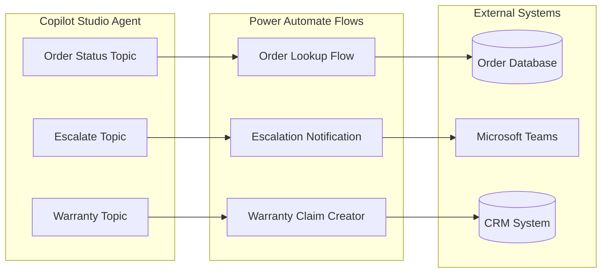
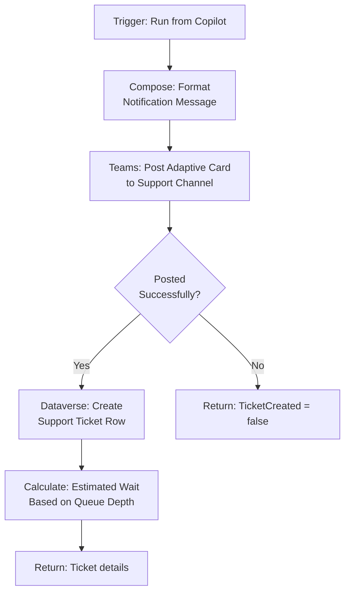

# Customer Service Assistant — Actions & Flows

This document catalogs Power Automate flows and connector integrations for the Customer Service Assistant agent.

## Actions Architecture



---

## Flow 1: Order Lookup

**Purpose:** Retrieves order status from backend system when customer asks about their order.

| Attribute | Value |
|-----------|-------|
| **Flow Name** | CS-OrderLookup |
| **Type** | Agent Flow (called from topic) |
| **Trigger** | Run a flow from Copilot |
| **Estimated Build Time** | 15 minutes |

### Input Parameters

| Parameter | Type | Required | Description |
|-----------|------|----------|-------------|
| OrderNumber | String | Yes | Customer's order reference number |
| CustomerEmail | String | No | Fallback lookup by email |

### Output Parameters

| Parameter | Type | Description |
|-----------|------|-------------|
| OrderFound | Boolean | Whether order was located |
| OrderStatus | String | Current status (Processing, Shipped, Delivered, etc.) |
| TrackingNumber | String | Carrier tracking reference |
| TrackingURL | String | Direct link to tracking page |
| EstimatedDelivery | DateTime | Expected delivery date |
| ShippingCarrier | String | Carrier name (FedEx, UPS, etc.) |

### Flow Design

```mermaid
flowchart TD
    A[Trigger: Run from Copilot] --> B{OrderNumber<br/>provided?}
    B --> |Yes| C[HTTP: Query Order API<br/>GET /orders/{OrderNumber}]
    B --> |No| D[HTTP: Query by Email<br/>GET /orders?email={email}]
    C --> E{Response<br/>Status?}
    D --> E
    E --> |200 OK| F[Parse JSON Response]
    E --> |404| G[Return: OrderFound = false]
    F --> H[Map fields to<br/>output variables]
    H --> I[Return: Order details]
```

### Connection References

| Connection | Type | Authentication |
|------------|------|----------------|
| Contoso Order API | HTTP with Azure AD | Service Principal |

### Environment Variables

| Variable | Description | Dev Value | Prod Value |
|----------|-------------|-----------|------------|
| OrderAPIBaseURL | Base URL for order API | `https://api-dev.contoso.com` | `https://api.contoso.com` |
| OrderAPIScope | OAuth scope | `api://dev-orders/.default` | `api://orders/.default` |

### Sample Response Mapping

```json
{
  "OrderFound": true,
  "OrderStatus": "Shipped",
  "TrackingNumber": "1Z999AA10123456784",
  "TrackingURL": "https://www.ups.com/track?tracknum=1Z999AA10123456784",
  "EstimatedDelivery": "2025-12-20T00:00:00Z",
  "ShippingCarrier": "UPS"
}
```

---

## Flow 2: Escalation Notification

**Purpose:** Notifies support team via Teams when a customer requests escalation to a human agent.

| Attribute | Value |
|-----------|-------|
| **Flow Name** | CS-EscalationNotify |
| **Type** | Agent Flow (called from topic) |
| **Trigger** | Run a flow from Copilot |
| **Estimated Build Time** | 10 minutes |

### Input Parameters

| Parameter | Type | Required | Description |
|-----------|------|----------|-------------|
| CustomerName | String | No | Customer's display name |
| IssueContext | String | Yes | Summary of the issue from conversation |
| ConversationID | String | Yes | Reference for conversation history |
| Priority | String | No | High, Medium, Low (default: Medium) |

### Output Parameters

| Parameter | Type | Description |
|-----------|------|-------------|
| TicketCreated | Boolean | Whether notification was sent |
| TicketNumber | String | Reference number for follow-up |
| EstimatedWait | Integer | Estimated wait time in minutes |

### Flow Design



### Adaptive Card Template

```json
{
  "$schema": "http://adaptivecards.io/schemas/adaptive-card.json",
  "type": "AdaptiveCard",
  "version": "1.5",
  "body": [
    {
      "type": "TextBlock",
      "text": "Customer Escalation Request",
      "weight": "Bolder",
      "size": "Large",
      "color": "Attention"
    },
    {
      "type": "FactSet",
      "facts": [
        { "title": "Customer", "value": "${CustomerName}" },
        { "title": "Priority", "value": "${Priority}" },
        { "title": "Ticket #", "value": "${TicketNumber}" }
      ]
    },
    {
      "type": "TextBlock",
      "text": "Issue Summary",
      "weight": "Bolder"
    },
    {
      "type": "TextBlock",
      "text": "${IssueContext}",
      "wrap": true
    }
  ],
  "actions": [
    {
      "type": "Action.OpenUrl",
      "title": "View Conversation",
      "url": "${ConversationURL}"
    },
    {
      "type": "Action.Submit",
      "title": "Claim Ticket",
      "data": { "action": "claim", "ticketId": "${TicketNumber}" }
    }
  ]
}
```

### Connection References

| Connection | Type | Authentication |
|------------|------|----------------|
| Microsoft Teams | Teams Connector | Delegated (User) |
| Dataverse | Dataverse Connector | Service Principal |

### Environment Variables

| Variable | Description | Dev Value | Prod Value |
|----------|-------------|-----------|------------|
| SupportTeamID | Teams Team ID | `guid-dev-team` | `guid-prod-team` |
| SupportChannelID | Channel for notifications | `guid-dev-channel` | `guid-prod-channel` |
| AvgHandleTime | Minutes per ticket (for wait calc) | `15` | `12` |

---

## Flow 3: Warranty Claim Creator

**Purpose:** Creates a warranty claim record when customer reports a product issue.

| Attribute | Value |
|-----------|-------|
| **Flow Name** | CS-WarrantyClaim |
| **Type** | Agent Flow (called from topic) |
| **Trigger** | Run a flow from Copilot |
| **Estimated Build Time** | 20 minutes |

### Input Parameters

| Parameter | Type | Required | Description |
|-----------|------|----------|-------------|
| OrderNumber | String | Yes | Original order reference |
| ProductSKU | String | No | Product identifier |
| IssueDescription | String | Yes | Description of the problem |
| CustomerEmail | String | Yes | Contact email for claim |

### Output Parameters

| Parameter | Type | Description |
|-----------|------|-------------|
| ClaimCreated | Boolean | Whether claim was successfully created |
| ClaimNumber | String | Reference number for the claim |
| NextSteps | String | Instructions for customer |

### Flow Design

```mermaid
flowchart TD
    A[Trigger: Run from Copilot] --> B[HTTP: Validate Order<br/>GET /orders/{OrderNumber}]
    B --> C{Order Valid &<br/>Under Warranty?}
    C --> |Yes| D[Dataverse: Create<br/>Warranty Claim Record]
    C --> |No - Expired| E[Return: Warranty expired<br/>message]
    C --> |No - Not Found| F[Return: Order not found]
    D --> G[Outlook: Send<br/>Confirmation Email]
    G --> H[Return: Claim details]
```

### Connection References

| Connection | Type | Authentication |
|------------|------|----------------|
| Contoso Order API | HTTP with Azure AD | Service Principal |
| Dataverse | Dataverse Connector | Service Principal |
| Outlook | Office 365 Outlook | Delegated (User) |

---

## Connector Reference

### Required Connectors

| Connector | Purpose | License Required |
|-----------|---------|------------------|
| HTTP with Azure AD | API calls to backend | Power Automate Premium |
| Microsoft Teams | Escalation notifications | Included with M365 |
| Dataverse | Ticket/claim storage | Power Platform environment |
| Office 365 Outlook | Email confirmations | Included with M365 |

### Optional Connectors (Enhancements)

| Connector | Purpose | Use Case |
|-----------|---------|----------|
| Dynamics 365 Customer Service | Full CRM integration | Enterprise deployments |
| Azure Service Bus | Event-driven processing | High-volume scenarios |
| Power BI | Analytics dashboards | Performance monitoring |

---

## ALM Considerations

### Solution Packaging

All flows should be added to the same solution as the Copilot Studio agent:

1. Create solution in Power Apps maker portal
2. Add existing flows to solution
3. Configure connection references (not hardcoded connections)
4. Set environment variables for each environment
5. Export as managed solution for production

### Deployment Checklist

| Step | Dev | Test | Prod |
|------|-----|------|------|
| Flows added to solution | [ ] | [ ] | [ ] |
| Connection references configured | [ ] | [ ] | [ ] |
| Environment variables set | [ ] | [ ] | [ ] |
| Service principal created | [ ] | [ ] | [ ] |
| API permissions granted | [ ] | [ ] | [ ] |
| Teams channel exists | [ ] | [ ] | [ ] |

---

## Testing Actions

### Test Scenarios

| Flow | Test Input | Expected Output |
|------|------------|-----------------|
| CS-OrderLookup | OrderNumber: "ORD-12345" | Returns order status and tracking |
| CS-OrderLookup | OrderNumber: "INVALID" | Returns OrderFound: false |
| CS-EscalationNotify | IssueContext: "Cannot reset password" | Posts to Teams, returns ticket # |
| CS-WarrantyClaim | Valid order under warranty | Creates claim, sends email |
| CS-WarrantyClaim | Expired warranty | Returns warranty expired message |

### Run History Monitoring

After deployment, monitor flow runs in Power Automate:
1. Go to **My flows** > Select flow
2. Click **28 day run history**
3. Check for failures and review error messages
4. Set up alerts for failed runs
