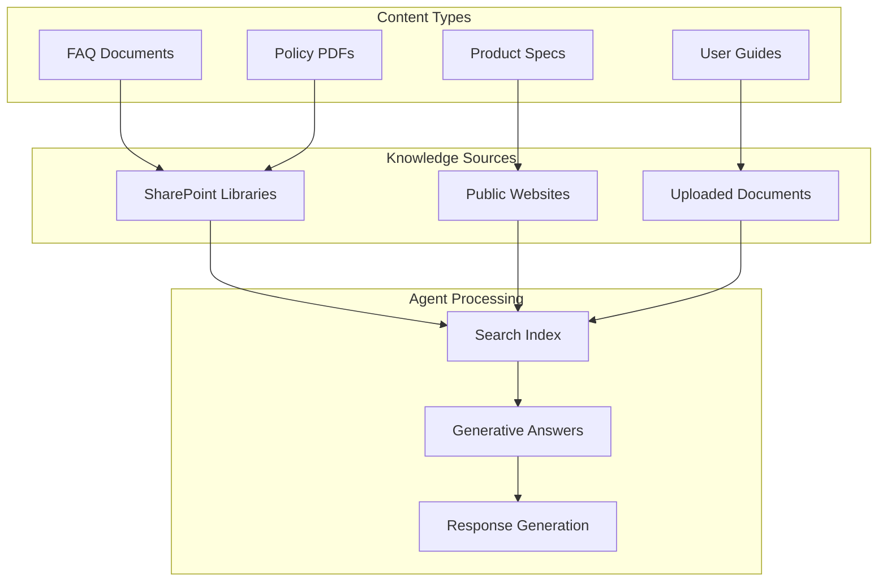
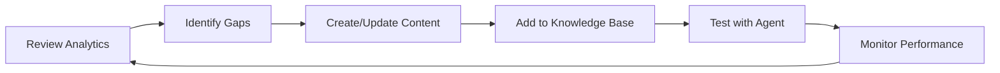

# Customer Service Assistant — Knowledge Sources

This document tracks all knowledge sources connected to the Customer Service Assistant agent for generative answers.

## Knowledge Architecture



---

## SharePoint Knowledge Sources

### Source 1: Customer Support Library

| Attribute | Value |
|-----------|-------|
| **Source Type** | SharePoint Site |
| **Location** | `https://contoso.sharepoint.com/sites/CustomerSupport` |
| **Content Type** | FAQs, Policy Documents, Process Guides |
| **Refresh Cadence** | Automatic (real-time) |
| **Responsible Owner** | Support Operations Team |
| **Last Review** | Monthly |

**Authentication Requirements:**
- Microsoft Entra ID app registration
- Scopes: `Sites.Read.All`, `Files.Read.All`
- User consent or admin consent granted

**Document Structure:**
```
/CustomerSupport
├── /FAQs
│   ├── General-FAQ.docx
│   ├── Shipping-FAQ.docx
│   ├── Returns-FAQ.docx
│   └── Warranty-FAQ.docx
├── /Policies
│   ├── Return-Policy.pdf
│   ├── Privacy-Policy.pdf
│   └── Terms-of-Service.pdf
├── /Product-Info
│   ├── Laptop-Specs.xlsx
│   ├── Tablet-Comparison.docx
│   └── Accessory-Guide.pdf
└── /Training
    └── Agent-Response-Guide.docx
```

**Content Guidelines:**
- Keep documents under 7 MB for optimal processing (200 MB with M365 Copilot license)
- Use clear headings and structured formatting
- Include relevant keywords naturally
- Update monthly or when policies change

### Source 2: Product Documentation Library

| Attribute | Value |
|-----------|-------|
| **Source Type** | SharePoint Site |
| **Location** | `https://contoso.sharepoint.com/sites/Products` |
| **Content Type** | Product specifications, user manuals |
| **Refresh Cadence** | Automatic |
| **Responsible Owner** | Product Marketing Team |

---

## Website Knowledge Sources

### Source 1: Contoso Support Portal

| Attribute | Value |
|-----------|-------|
| **Source Type** | Public Website |
| **URLs** | See list below |
| **Content Type** | Product pages, support articles |
| **Refresh Cadence** | Weekly crawl |
| **Last Verified** | Check monthly for broken links |

**URLs Configured:**
```
https://www.contoso.com/support
https://www.contoso.com/support/faq
https://www.contoso.com/products
https://www.contoso.com/products/laptops
https://www.contoso.com/products/tablets
https://www.contoso.com/warranty
https://www.contoso.com/returns
```

**Website Crawl Limitations:**
- Only public pages are indexed (no authentication)
- Dynamic JavaScript content may not be captured
- Crawl respects robots.txt
- Maximum 100 pages per domain

---

## Uploaded Documents

For content not available in SharePoint or public websites, upload directly to Copilot Studio.

### Document 1: Quick Reference Card

| Attribute | Value |
|-----------|-------|
| **File Name** | Contoso-Support-QuickRef.pdf |
| **Purpose** | Common questions and answers for agents |
| **File Size** | 2.3 MB |
| **Last Updated** | 2025-11-15 |

### Document 2: Shipping Zones & Timing

| Attribute | Value |
|-----------|-------|
| **File Name** | Shipping-Zones-2025.xlsx |
| **Purpose** | Delivery timeframes by region |
| **File Size** | 145 KB |
| **Last Updated** | 2025-01-01 |

---

## Sample FAQ Content

Below is sample FAQ content to add to SharePoint for training purposes.

### General FAQ (General-FAQ.docx)

```markdown
# Contoso Electronics - Frequently Asked Questions

## Ordering

**Q: How do I place an order?**
A: Visit contoso.com, add items to your cart, and proceed to checkout.
You can pay with credit card, PayPal, or Contoso Gift Card.

**Q: Can I modify my order after placing it?**
A: Orders can be modified within 1 hour of placement. After that,
you'll need to cancel and reorder. Contact support for assistance.

**Q: Do you offer gift wrapping?**
A: Yes! Select "Gift Wrap" at checkout for $5.99 per item.

## Shipping

**Q: How long does shipping take?**
A: Standard shipping: 5-7 business days
   Express shipping: 2-3 business days
   Next-day shipping: Order by 2 PM for next business day delivery

**Q: Do you ship internationally?**
A: We currently ship to the US, Canada, and UK. International
shipping rates are calculated at checkout.

**Q: How do I track my order?**
A: Once shipped, you'll receive an email with tracking information.
You can also log into your account to view order status.

## Returns & Refunds

**Q: What is your return policy?**
A: We offer a 30-day satisfaction guarantee. Items must be returned
in original packaging. Refunds are processed within 5-7 business days.

**Q: How do I start a return?**
A: Log into your account, go to Order History, select the order,
and click "Start Return." You'll receive a prepaid shipping label.

**Q: Are there any items that cannot be returned?**
A: Opened software, personalized items, and clearance items marked
"Final Sale" cannot be returned.
```

### Return Policy (Return-Policy.pdf)

```markdown
# Contoso Electronics Return Policy

Effective Date: January 1, 2025

## 30-Day Satisfaction Guarantee

We want you to be completely satisfied with your purchase. If you're
not happy for any reason, you may return most items within 30 days
of delivery for a full refund.

## Return Eligibility

### Eligible for Return
- New, unopened items in original packaging
- Opened items in like-new condition with all accessories
- Defective items (any condition)

### Not Eligible for Return
- Items purchased more than 30 days ago
- Opened software or digital downloads
- Personalized or custom-built items
- Items marked "Final Sale"
- Gift cards

## Return Process

1. **Initiate Return**: Log into your account or contact support
2. **Receive Label**: We'll email a prepaid return shipping label
3. **Pack Item**: Use original packaging if possible
4. **Ship**: Drop off at any UPS location
5. **Refund**: Processed within 5-7 business days of receipt

## Refund Methods

- Original payment method: 5-7 business days
- Store credit: Immediate upon receipt
- Exchange: Ships within 2-3 business days

## Defective Items

If you receive a defective item, contact us immediately for:
- Free expedited replacement shipping
- Full refund including original shipping costs
- Extended return window (90 days for defects)

## Contact Us

- Phone: 1-800-CONTOSO (Mon-Fri 8AM-8PM EST)
- Chat: contoso.com/support
- Email: returns@contoso.com
```

---

## Knowledge Source Configuration

### Generative AI Settings

| Setting | Value | Rationale |
|---------|-------|-----------|
| **Generative answers** | Enabled | Powers dynamic responses |
| **Content moderation** | High | Customer-facing, minimize risk |
| **AI General Knowledge** | Disabled | Restrict to configured sources only |
| **Citation style** | Inline | Shows source for transparency |

### Source Priority

When multiple sources might answer a question, Copilot Studio prioritizes:

1. **Topic-level sources** (configured in Generative Answers node)
2. **Agent-level sources** (configured in Knowledge panel)
3. **Fallback behavior** (configured in Settings)

### Best Practices Applied

| Practice | Implementation |
|----------|----------------|
| Structured content | Use headings, bullet points, tables |
| Clear language | Avoid jargon, write at 8th-grade level |
| Current information | Monthly review cycle |
| Metadata tags | SharePoint managed metadata for filtering |
| Access control | Respect user permissions |

---

## Content Maintenance Schedule

| Task | Frequency | Owner |
|------|-----------|-------|
| Review FAQ accuracy | Monthly | Support Lead |
| Update product specs | With each release | Product Team |
| Verify website links | Weekly | Automation |
| Policy document review | Quarterly | Legal Team |
| Knowledge gap analysis | Monthly | Analytics Team |

---

## Monitoring & Optimization

### Analytics to Track

1. **Topic triggering rate** — Which topics are most used
2. **Generative answer quality** — User satisfaction ratings
3. **Fallback rate** — How often knowledge sources fail to answer
4. **Citation accuracy** — Are sources correctly attributed

### Improvement Process



### Common Issues & Solutions

| Issue | Likely Cause | Solution |
|-------|--------------|----------|
| No answer returned | Content not indexed | Wait 30-60 min after upload |
| Wrong answer | Ambiguous content | Add more specific phrasing |
| Outdated answer | Stale content | Update source document |
| Missing citation | Source not configured | Add source to generative answers node |
