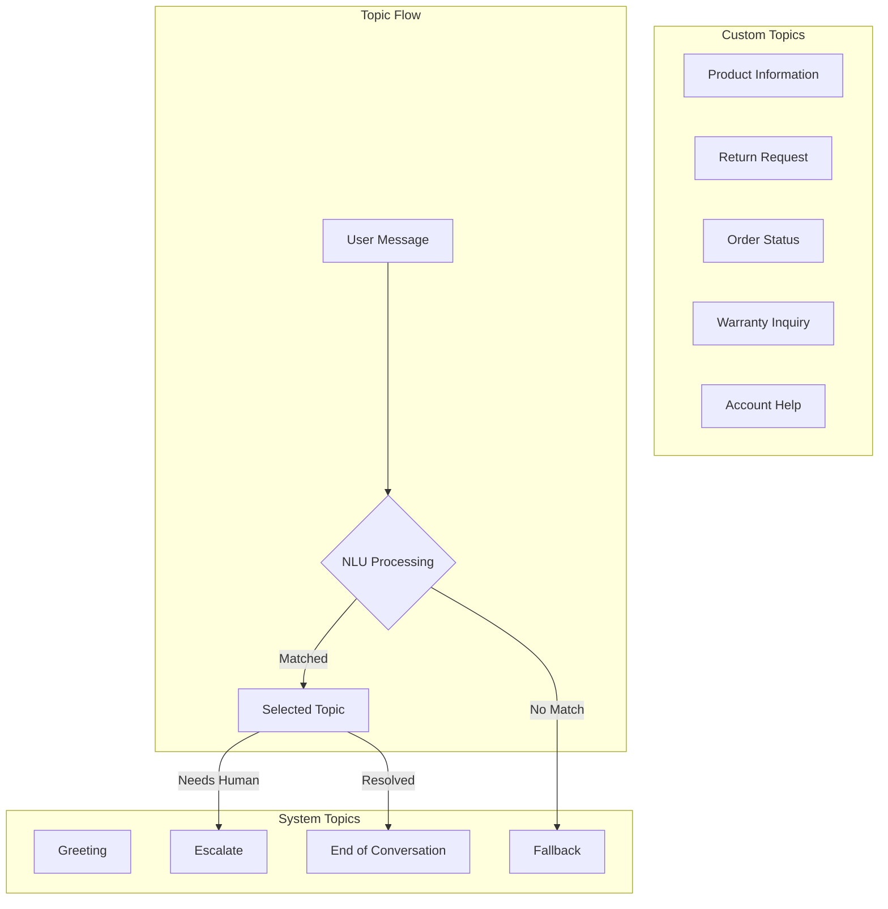
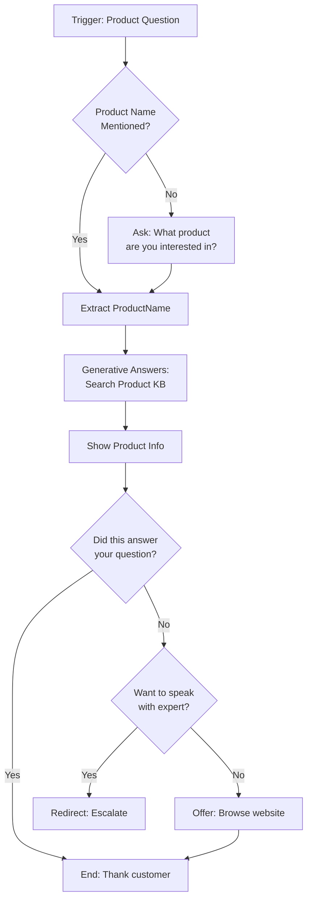
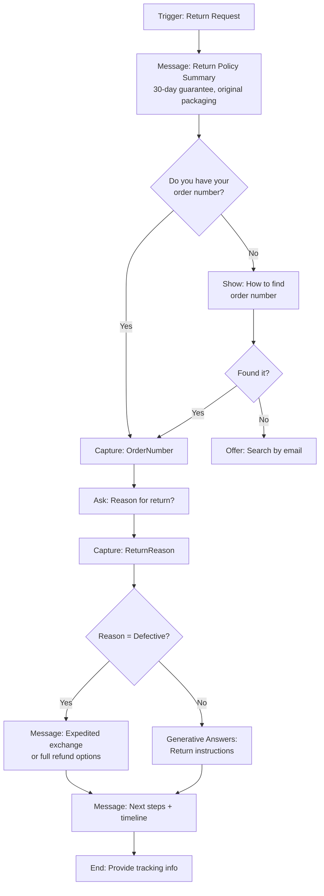
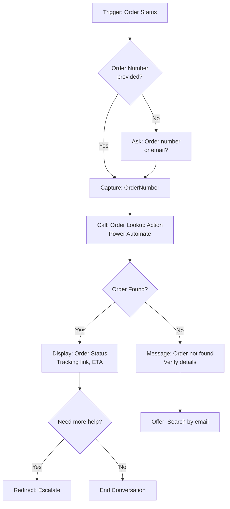
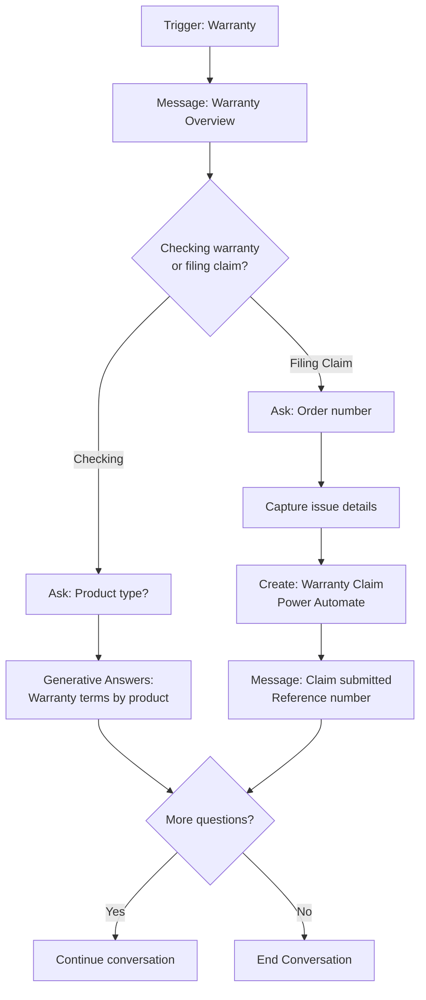
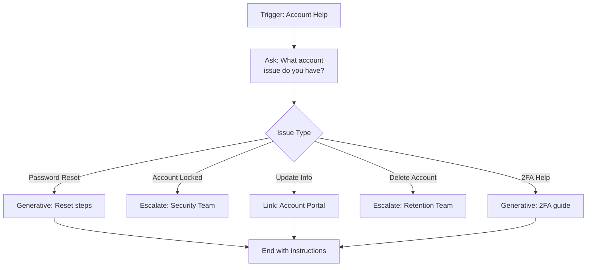

# Customer Service Assistant — Topics

This document details every topic to configure in Copilot Studio for the Customer Service Assistant agent.

## Topics Architecture



---

## System Topics Configuration

### Greeting Topic
**Status:** Auto-generated, customize message

**Customization:**
```
Hello! Welcome to Contoso Electronics support. I'm your virtual assistant,
ready to help with:

- Product questions and specifications
- Order status and tracking
- Returns and refunds
- Warranty information

How can I help you today?
```

**Conversation Starters:**
| Starter | Associated Topic |
|---------|------------------|
| "Check my order status" | Order Status |
| "I want to return something" | Return Request |
| "Product recommendations" | Product Information |
| "Talk to a human" | Escalate |

### Fallback Topic
**Status:** Auto-generated, customize for brand voice

**Customization:**
```
I'm not sure I understood that correctly. Could you rephrase your question?

Here are some things I can help with:
- Product information and specifications
- Order status and tracking
- Returns and exchanges
- Warranty questions

Or type "agent" to speak with a support specialist.
```

### Escalate Topic
**Status:** Enhanced with context capture

**Flow:**
1. Acknowledge escalation request
2. Capture issue summary (optional)
3. Trigger Teams notification (via Power Automate)
4. Provide estimated wait time
5. End conversation or offer callback option

---

## Custom Topics Backlog

### Topic 1: Product Information

| Attribute | Value |
|-----------|-------|
| **Topic Name** | Product Information |
| **Description** | Helps customers find product details, specifications, and availability |
| **Trigger Type** | User says a phrase |

**Trigger Phrases:**
```
What products do you sell?
Tell me about your products
Product specifications
Do you have [product name]?
What are the features of [product]?
Is [product] compatible with [device]?
Show me laptops
Show me tablets
Product comparison
What's the difference between [product A] and [product B]?
```

**Variables:**
| Variable Name | Type | Purpose |
|---------------|------|---------|
| ProductCategory | Choice | Laptop, Tablet, Accessory, Other |
| ProductName | Text | Specific product user is asking about |
| SatisfactionResponse | Boolean | Whether user's question was answered |

**Conversation Flow:**


**Generative Answers Configuration:**
- **Sources:** SharePoint Product Library, Product Website
- **Moderation:** High
- **Fallback:** "I don't have specific details on that product. Would you like me to connect you with a product specialist?"

---

### Topic 2: Return Request

| Attribute | Value |
|-----------|-------|
| **Topic Name** | Return Request |
| **Description** | Guides customers through the return process |
| **Trigger Type** | User says a phrase |

**Trigger Phrases:**
```
I want to return something
How do I return a product?
Return policy
Can I get a refund?
I'm not happy with my purchase
Exchange an item
Return my order
Refund request
I changed my mind about my order
Product is defective
Wrong item received
```

**Variables:**
| Variable Name | Type | Purpose |
|---------------|------|---------|
| OrderNumber | Text | Customer's order reference |
| ReturnReason | Choice | Reason for return (see options below) |
| HasReceipt | Boolean | Whether customer can provide proof of purchase |

**Return Reason Options:**
1. Defective or damaged product
2. Wrong item received
3. Changed my mind
4. Found better price elsewhere
5. Product doesn't match description
6. Other

**Conversation Flow:**


**Key Messages:**

*Policy Summary:*
```
Great, I can help with your return! Here's what you need to know:

**30-Day Satisfaction Guarantee**
- Returns accepted within 30 days of delivery
- Product must be in original packaging
- Refunds processed within 5-7 business days

Let me help you get started.
```

*Order Number Help:*
```
No problem! You can find your order number:
1. In your confirmation email (subject: "Order Confirmed")
2. On your packing slip
3. In your Contoso account under "Order History"

Did you find it?
```

---

### Topic 3: Order Status

| Attribute | Value |
|-----------|-------|
| **Topic Name** | Order Status |
| **Description** | Helps customers check order status and tracking |
| **Trigger Type** | User says a phrase |

**Trigger Phrases:**
```
Where is my order?
Order status
Track my order
When will my order arrive?
Shipping update
Delivery status
Has my order shipped?
Order tracking number
Expected delivery date
```

**Variables:**
| Variable Name | Type | Purpose |
|---------------|------|---------|
| OrderNumber | Text | Customer's order reference |
| OrderEmail | Email | Email used for order (backup lookup) |

**Conversation Flow:**


**Note:** This topic requires Power Automate integration to look up order status. See `actions/README.md` for flow details.

---

### Topic 4: Warranty Inquiry

| Attribute | Value |
|-----------|-------|
| **Topic Name** | Warranty Inquiry |
| **Description** | Answers warranty questions and initiates claims |
| **Trigger Type** | User says a phrase |

**Trigger Phrases:**
```
Warranty information
Is my product under warranty?
How long is the warranty?
Warranty claim
My product broke
Warranty coverage
Extended warranty
Warranty registration
```

**Variables:**
| Variable Name | Type | Purpose |
|---------------|------|---------|
| ProductCategory | Choice | Type of product for warranty lookup |
| PurchaseDate | Date | When product was purchased |
| IssueDescription | Text | What's wrong with the product |

**Conversation Flow:**


**Warranty Information by Category:**
| Product Category | Standard Warranty | Extended Available |
|------------------|-------------------|-------------------|
| Laptops | 2 years | Yes, up to 4 years |
| Tablets | 1 year | Yes, up to 3 years |
| Accessories | 90 days | No |
| Refurbished | 6 months | Yes, up to 2 years |

---

### Topic 5: Account Help

| Attribute | Value |
|-----------|-------|
| **Topic Name** | Account Help |
| **Description** | Assists with login issues and account management |
| **Trigger Type** | User says a phrase |

**Trigger Phrases:**
```
I can't log in
Reset my password
Account locked
Update my email
Change my address
Account settings
Profile update
Delete my account
Two-factor authentication help
```

**Variables:**
| Variable Name | Type | Purpose |
|---------------|------|---------|
| AccountIssue | Choice | Type of account issue |
| AccountEmail | Email | Email associated with account |

**Account Issue Options:**
1. Password reset
2. Account locked
3. Update contact info
4. Delete account
5. 2FA/MFA help
6. Other

**Conversation Flow:**


---

## Topic Naming Conventions

Follow these Microsoft best practices:

1. **No periods (.)** in topic names — causes solution export failures
2. **Use descriptive names** — helps with analytics and debugging
3. **Prefix related topics** — e.g., "Product - Inquiry", "Product - Comparison"
4. **Keep names under 50 characters** — improves readability in topic list

## Testing Checklist

| Topic | Test Phrase 1 | Test Phrase 2 | Expected Result |
|-------|--------------|---------------|-----------------|
| Product Information | "What laptops do you have?" | "Is the Pro X15 good for gaming?" | Shows product details |
| Return Request | "I want to return my order" | "What's your refund policy?" | Starts return flow |
| Order Status | "Where is my order?" | "Track order 12345" | Shows status or asks for order # |
| Warranty Inquiry | "Is my laptop under warranty?" | "I need to file a warranty claim" | Shows warranty info or starts claim |
| Account Help | "I forgot my password" | "How do I update my email?" | Provides appropriate guidance |

## Overlap Resolution

If topics have overlapping triggers, create a disambiguation topic:

**Example:** "Help with my order" could mean Order Status or Return Request

**Disambiguation Flow:**
```
User: Help with my order

Agent: I can help! Are you looking to:
1. Check your order status
2. Return or exchange an item
3. Something else

(Buttons for each option)
```

## Implemented in this repo

These topics are implemented as learner-friendly blueprints:

- `T01_ReturnsAndRefunds`
- `T02_OrderStatus`
- `T03_EscalateToHuman`

Each folder contains:
- `topic.build.md` (click-by-click build guide)
- `topic.blueprint.yaml` (topic “source code” blueprint)
- `assets/` (test payloads and transcripts)

