# Document Processor Agent

**Course Segment:** Hour 4 — Autonomous Agents & Event Triggers
**Difficulty:** Advanced
**Estimated Build Time:** 45-50 minutes

## Overview

This build turns Microsoft Copilot Studio into a background automation worker. The agent watches a SharePoint document library, calls AI Builder for document understanding, and then orchestrates Power Automate flows that notify downstream teams. The design patterns map directly to the guidance in the current Microsoft documentation for [automated copilots triggered by events](https://learn.microsoft.com/microsoft-copilot-studio/authoring-triggers) and [AI Builder document processing](https://learn.microsoft.com/ai-builder/document-processing-model-overview).

```mermaid
flowchart TD
    subgraph "Event Sources"
        E1[SharePoint<br/>File Created]
        E2[Microsoft 365<br/>Email Attachment]
        E3[OneDrive<br/>File Modified]
    end

    subgraph "Copilot Studio Agent"
        E1 --> T[Trigger Topic]
        E2 --> T
        E3 --> T
        T --> C{AI Builder<br/>Classification}
        C --> |Invoice| P1[Route to Finance Flow]
        C --> |Contract| P2[Route to Legal Flow]
        C --> |Resume| P3[Route to Talent Flow]
        C --> |Low Confidence| P4[Manual Review Flow]
        P1 --> N[Teams / Email Alerts]
        P2 --> N
        P3 --> N
        P4 --> N
    end

    subgraph "Downstream Systems"
        P1 --> AP[Finance Workspace]
        P2 --> LEG[SharePoint Contract Site]
        P3 --> HR[HRIS Intake List]
        P4 --> QA[Exception Tracker]
    end

    style E1 fill:#000000
    style E2 fill:#000000
    style E3 fill:#000000
    style C fill:#000000
```



## Learning Objectives

By completing this project, you will:

1. Configure an autonomous Copilot Studio agent that reacts to SharePoint and Microsoft 365 triggers.
2. Call AI Builder document processing from an agent topic and route on confidence scores.
3. Build Power Automate flows that update Dataverse tables and send Teams notifications.
4. Add exception handling paths for low-quality documents.
5. Monitor health and latency using the Copilot Studio analytics workspace.

## Prerequisites

- Completion of the Hour 2 and Hour 3 builds in this course.
- Microsoft 365 Developer or production tenant with SharePoint, Exchange, and Teams enabled. Join the free [Microsoft 365 Developer Program](https://developer.microsoft.com/microsoft-365/dev-program) if you need a sandbox.
- AI Builder credits or trial. Follow [Get access to AI Builder](https://learn.microsoft.com/ai-builder/ai-builder-licensing) for licensing steps.
- Power Automate access with premium connectors (SharePoint, Office 365 Outlook, Microsoft Teams, Dataverse).

---

## Scenario

A finance operations team needs incoming documents sorted automatically:

- Vendor invoices (PDF) should post to the accounts payable workspace and notify the finance channel.
- Executed contracts (DOCX/PDF) require legal review and storage in a secure SharePoint library.
- Resumes (PDF/DOCX) must be routed to the recruiting team with extracted skills.
- Anything the model cannot classify confidently goes to a quality assurance queue.

**Success Metrics**

| Metric | Target | Measurement |
|--------|--------|-------------|
| Auto-Classification Rate | ≥ 80% | Percentage of files assigned without human touch |
| Processing Latency | ≤ 5 minutes | Upload-to-notification duration |
| Classification Accuracy | ≥ 95% | Manual spot-check accuracy |
| Exception Rate | ≤ 20% | Percentage of files falling back to QA |

---

## Step-by-Step Build Guide

### Phase 1: Environment and Data Prep (10 minutes)

1. **Provision a SharePoint site** dedicated to automation. Reference [Create a communication site in SharePoint](https://learn.microsoft.com/sharepoint/create-site-collection) and name it “Document Automation”.
2. **Create a document library** named `Incoming Documents`. Enable versioning and require checkout if your governance policy demands it.
3. **Load sample files**:
   - Download the Microsoft invoice sample set from the [AI Builder invoice processing starter kit](https://github.com/microsoft/PowerApps-Samples/tree/main/ai-builder/starter-kit/invoice-processing) (`sample-documents` folder).
   - Pull the contract templates published in the [Microsoft 365 E5 sample data packs](https://learn.microsoft.com/microsoft-365/enterprise/sample-data-packages) or generate DOCX files with an LLM as needed.
   - Generate resumes with another LLM and export them as PDF and DOCX. Keep at least five per category so AI Builder can detect structure.
4. **Capture metadata**. Create a Dataverse table called `Document Processing Log` with columns for `FileName`, `DocumentType`, `Confidence`, `ProcessedOn`, and `HandledBy`.

### Phase 2: Create the Autonomous Agent (10 minutes)

1. Open [copilotstudio.microsoft.com](https://copilotstudio.microsoft.com) and follow [Create a copilot](https://learn.microsoft.com/microsoft-copilot-studio/create-copilot) to add a new agent.
2. Use this prompt when Copilot Studio asks for a description:

   ```
   Build an automated document processor that monitors a SharePoint library,
   classifies files with AI Builder, routes invoices to finance, contracts to
   legal, resumes to talent acquisition, and sends Teams alerts. Drop low
   confidence files into a quality assurance queue.
   ```

3. After creation, go to **Settings → Agent type** and switch to **Autonomous agent**. The agent should not expose conversational channels.
4. Confirm the agent is added to an environment where AI Builder is allowed. The [Environment requirements checklist](https://learn.microsoft.com/microsoft-copilot-studio/environments-environment-strategy) describes supported regions and capacity.

### Phase 3: Configure Event Triggers and Topics (15 minutes)

1. Navigate to **Topics → + Add trigger → When a file is created (SharePoint)**.
2. Configure the parameters:
   - **Site address:** use the site you created (`https://<tenant>.sharepoint.com/sites/DocumentAutomation`).
   - **Library name:** `Incoming Documents`.
   - **Folder path:** leave blank for root, or target `/Unprocessed` if you prefer staging.
   - **Authentication:** select Microsoft Entra ID and ensure the connection has `Sites.Read.All` permissions.
3. Create a topic named `Process Incoming Document` and design the flow:

   ```mermaid
   flowchart TD
       Start[Trigger: File Created] --> S1[Get file metadata]
       S1 --> S2[Store file URL → variable FileUrl]
       S2 --> S3[Call AI Builder flow]
       S3 --> Decision{Confidence >= 0.8?}
       Decision -->|Yes| Classify{Document Type}
       Decision -->|No| QA[Run QA routing flow]
       Classify -->|Invoice| Finance[Run Finance routing flow]
       Classify -->|Contract| Legal[Run Legal routing flow]
       Classify -->|Resume| Talent[Run Talent routing flow]
       Finance --> Notify[Post Teams message + write to Dataverse]
       Legal --> Notify
       Talent --> Notify
       QA --> Notify
   ```

4. In the topic authoring canvas, store the SharePoint file name, URL, and uploader as variables so you can hand them to Power Automate.

### Phase 4: Build the AI Builder Classification Flow (15 minutes)

1. In Power Automate, select **Create → Instant cloud flow → Run a flow from Copilot**.
2. Name the flow `DocProc-Classification` and add the following inputs: `FileUrl` (text), `FileName` (text), and `TriggeringUser` (text).
3. Steps:
   - **Get file content** using the SharePoint `Get file content using path` action.
   - **Predict** using the AI Builder **Document processing** model trained with your sample files. Follow [Train a document processing model](https://learn.microsoft.com/ai-builder/create-document-processing-model). Export the model ID and add it to the flow.
   - **Return outputs** to Copilot Studio: `DocumentType`, `Confidence`, `VendorName`, `DueDate`, `TotalAmount`, and `DetectedText` (if available).
4. Save the flow and share the connection references in your solution so deployment stays portable.

### Phase 5: Routing Flows (10 minutes)

Create three additional `Run a flow from Copilot` flows. Each should log the result to Dataverse and send Teams alerts.

| Flow | Inputs | Key Actions | Outputs |
|------|--------|-------------|---------|
| `DocProc-Invoice` | FileUrl, VendorName, TotalAmount, Confidence | Create/Update row in `Invoice` table → Post adaptive card to Teams finance channel → Optionally start approval using [Approvals connector](https://learn.microsoft.com/power-automate/approvals) | `HandledBy`, `InvoiceRecordId` |
| `DocProc-Contract` | FileUrl, DetectedText | Copy file into a secure SharePoint library using [Copy file](https://learn.microsoft.com/connectors/sharepointonline/#copy-file) → Notify legal channel with summary excerpt | `HandledBy`, `ContractLink` |
| `DocProc-Resume` | FileUrl, DetectedText | Write candidate record to Dataverse (Name, Skills, Contact info) → Send Teams message with quick actions link | `HandledBy`, `CandidateRecordId` |

For low-confidence documents, add `DocProc-QA` that moves the file to an `Exceptions` folder and posts to a QA channel.

### Phase 6: Testing and Monitoring (5 minutes)

1. Upload one invoice, contract, and resume into the `Incoming Documents` library. Validate that each Power Automate flow runs successfully.
2. Review **Copilot Studio → Analytics → Agent activity** for trigger counts, latency, and errors. The [Agent health dashboard](https://learn.microsoft.com/microsoft-copilot-studio/analytics-improve-agent-health) highlights retries and failures.
3. Inspect the `Document Processing Log` Dataverse table to ensure records are created with correct metadata.
4. Use the **Run history** tab in Power Automate to troubleshoot failed flows. Pay attention to AI Builder throttling limits documented in [AI Builder capacity](https://learn.microsoft.com/ai-builder/credit-management).

---

## Sample Processing Log

```
[2025-12-12 09:15:23] TRIGGER: File created - Invoice_7521.pdf
[2025-12-12 09:15:25] CLASSIFY: Type=Invoice, Confidence=0.94
[2025-12-12 09:15:27] ROUTE: DocProc-Invoice flow succeeded (InvoiceRecordId=INV-2041)
[2025-12-12 09:15:28] NOTIFY: Teams message posted to Finance Automation channel

[2025-12-12 09:18:45] TRIGGER: File created - Resume_AlexMorgan.pdf
[2025-12-12 09:18:47] CLASSIFY: Type=Resume, Confidence=0.72
[2025-12-12 09:18:48] QA: Low confidence threshold triggered → DocProc-QA flow moved file to Exceptions
[2025-12-12 09:18:49] NOTIFY: Teams message posted to Quality Assurance channel
```

---

## Folder Contents

| Folder | Contents |
|--------|----------|
| `topics/` | Trigger configuration, variable maps, fallback logic |
| `actions/` | Power Automate flow definitions, connection references, adaptive card templates |
| `knowledge/` | Model training guidance, retention policy checklist, QA playbook |

---

## Additional Resources

- [Automated copilots triggered by events](https://learn.microsoft.com/microsoft-copilot-studio/authoring-triggers)
- [AI Builder document processing overview](https://learn.microsoft.com/ai-builder/document-processing-model-overview)
- [Document automation end-to-end tutorial](https://learn.microsoft.com/power-automate/document-automation/overview)
- [Monitor copilot analytics](https://learn.microsoft.com/microsoft-copilot-studio/analytics-improve-agent-health)
- [Power Automate solution lifecycle guidance](https://learn.microsoft.com/power-platform/alm/overview)
