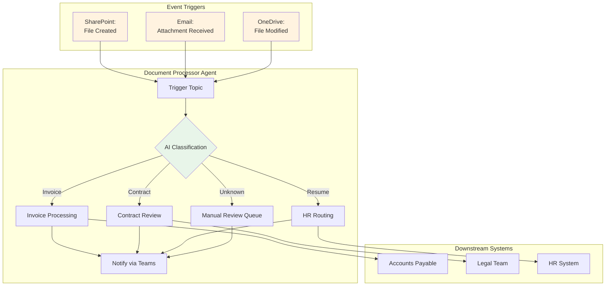
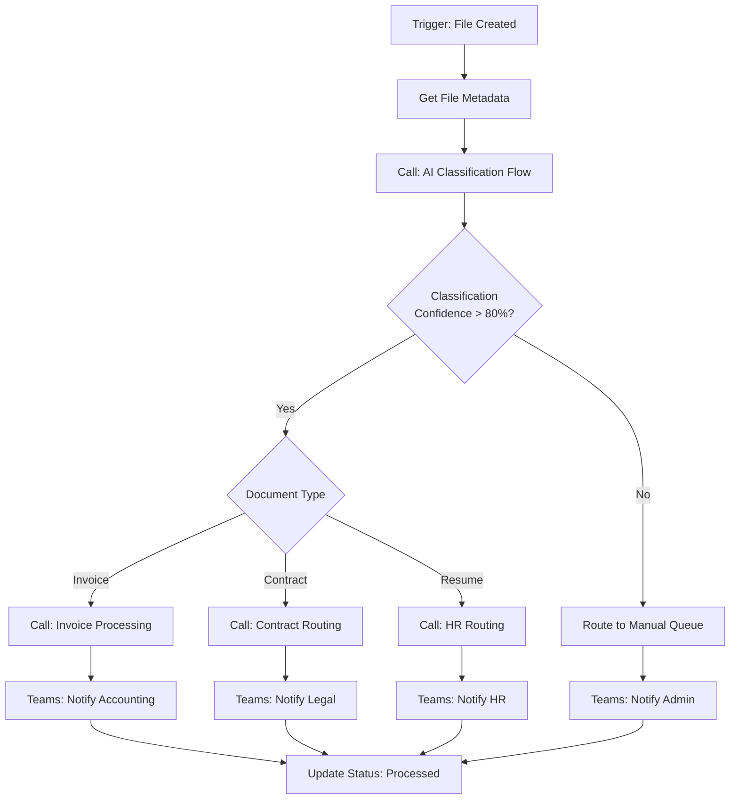
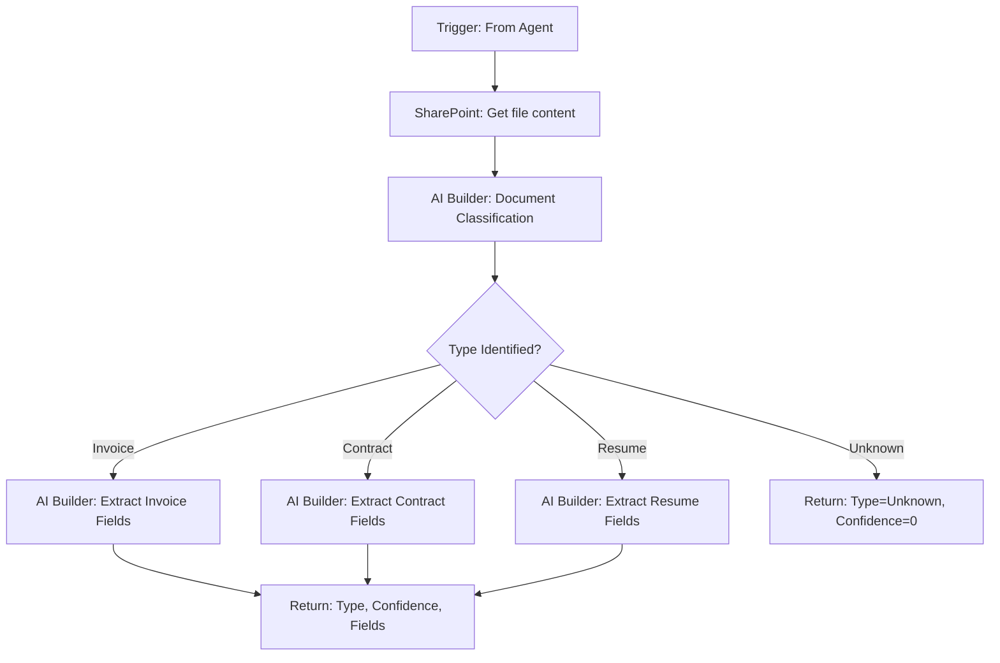

# Document Processor Agent

**Course Segment:** Hour 4 — Autonomous Agents & Event Triggers
**Difficulty:** Advanced
**Estimated Build Time:** 45-50 minutes

## Overview

The Document Processor Agent is an **autonomous agent** that runs without user interaction, automatically processing documents when they arrive in SharePoint. This demonstrates event-triggered automation, AI classification, and background orchestration.



## Learning Objectives

By completing this project, participants will:

1. Configure autonomous agents that run without user input
2. Set up event triggers (file creation, email arrival)
3. Use AI Builder for document classification
4. Implement exception handling for low-confidence results
5. Monitor autonomous agent health and performance
6. Configure Teams notifications for processing status

## Prerequisites

- Completed Hours 2-3
- AI Builder access (for document classification)
- SharePoint document library for testing

---

## Scenario: Contoso Document Automation

**Business Context:** Contoso's accounting department receives 200+ documents daily via email and SharePoint uploads:
- Invoices requiring payment processing
- Contracts needing legal review
- Resumes for HR screening
- Miscellaneous documents requiring manual triage

**Goal:** Automatically classify and route 80% of incoming documents without human intervention.

**Success Metrics:**
| Metric | Target | Measurement |
|--------|--------|-------------|
| Auto-Classification Rate | 80%+ | % classified without manual intervention |
| Processing Latency | < 5 minutes | Time from upload to routing |
| Classification Accuracy | 95%+ | Correct routing percentage |
| Exception Rate | < 20% | Documents requiring manual review |

---

## Step-by-Step Build Guide

### Phase 1: Create Autonomous Agent (10 minutes)

#### Step 1.1: Create the Agent
1. Go to [copilotstudio.microsoft.com](https://copilotstudio.microsoft.com)
2. Click **+ Create** > **New agent**
3. Describe the agent:
```
Create an autonomous document processor that monitors a SharePoint library
for new files, classifies them using AI, and routes them to appropriate
teams. The agent should run automatically without user interaction and
send Teams notifications when documents are processed.
```

#### Step 1.2: Configure as Autonomous
1. Go to **Settings** > **Agent type**
2. Select **Autonomous agent**
3. Disable conversational channels (this agent runs in background)

> **Key Concept:** Autonomous agents respond to events rather than user messages. See [Create automated copilots triggered by events](https://learn.microsoft.com/en-us/power-platform/release-plan/2024wave2/microsoft-copilot-studio/create-automated-copilots-triggered-events).

---

### Phase 2: Configure Event Triggers (15 minutes)

#### Step 2.1: SharePoint File Trigger
1. Go to **Topics** > **+ Add trigger**
2. Select **When a file is created (SharePoint)**
3. Configure:
   - **Site:** `https://contoso.sharepoint.com/sites/Documents`
   - **Library:** Incoming Documents
   - **Folder:** (root or specific folder)

#### Step 2.2: Create Processing Topic

**Topic: Process New Document**



#### Step 2.3: Exception Handling Topic

**Topic: Handle Processing Error**

Triggers when classification fails or downstream system is unavailable:
1. Log error to Dataverse
2. Move file to Exception folder
3. Send alert to admin channel
4. Create support ticket if threshold exceeded

---

### Phase 3: Create AI Classification Flow (15 minutes)

#### Flow: Document Classification

| Attribute | Value |
|-----------|-------|
| **Name** | DocProc-Classify |
| **Trigger** | Run a flow from Copilot |

**Input:** FileURL, FileName
**Output:** DocumentType, Confidence, ExtractedData

**Flow Steps:**


#### AI Builder Model Setup

**Pre-built Models Used:**
| Model | Purpose | Output |
|-------|---------|--------|
| Invoice processing | Extract vendor, amount, date | Structured invoice data |
| Text classification | Categorize document type | Category + confidence |
| Key phrase extraction | Identify important terms | Array of key phrases |

---

### Phase 4: Configure Routing Flows (10 minutes)

#### Flow: Invoice Processing
1. Extract vendor, amount, due date
2. Create Dataverse record in Invoices table
3. If amount > $10,000: Start approval
4. Notify Accounts Payable channel

#### Flow: Contract Routing
1. Extract parties, dates, key terms
2. Create Dataverse record in Contracts table
3. Assign to Legal review queue
4. Notify Legal channel with summary

#### Flow: HR Resume Routing
1. Extract candidate name, skills, experience
2. Create Dataverse record in Candidates table
3. Match to open positions (optional)
4. Notify Recruiting channel

---

### Phase 5: Monitor and Test (5 minutes)

#### Testing Autonomous Agents
1. Upload test documents to SharePoint:
   - Sample invoice PDF
   - Sample contract DOCX
   - Sample resume PDF
2. Monitor **Agent activity** dashboard
3. Check Teams channels for notifications
4. Verify Dataverse records created

#### Analytics Dashboard
Go to **Analytics** > **Agent health** to monitor:
- Trigger frequency
- Processing success rate
- Average latency
- Error patterns

---

## Sample Processing Log

```
[2025-12-12 09:15:23] TRIGGER: File created - Invoice_Contoso_Dec2025.pdf
[2025-12-12 09:15:25] CLASSIFY: Type=Invoice, Confidence=94%
[2025-12-12 09:15:27] EXTRACT: Vendor=Contoso Supplies, Amount=$4,500, Due=2025-12-30
[2025-12-12 09:15:29] ROUTE: Created invoice record INV-2025-1847
[2025-12-12 09:15:30] NOTIFY: Posted to #accounting-invoices channel
[2025-12-12 09:15:30] COMPLETE: Processing time = 7 seconds

[2025-12-12 09:18:45] TRIGGER: File created - Unknown_Document.pdf
[2025-12-12 09:18:47] CLASSIFY: Type=Unknown, Confidence=35%
[2025-12-12 09:18:48] EXCEPTION: Low confidence - routing to manual queue
[2025-12-12 09:18:49] NOTIFY: Posted to #document-exceptions channel
```

---

## Folder Contents

| Folder | Contents |
|--------|----------|
| `topics/` | Event trigger configurations and processing flows |
| `actions/` | AI Builder integration and routing flows |
| `knowledge/` | Classification rules and exception handling guides |

---

## Additional Resources

- [Autonomous Agents Overview](https://learn.microsoft.com/en-us/power-platform/release-plan/2024wave2/microsoft-copilot-studio/create-automated-copilots-triggered-events)
- [AI Builder Document Processing](https://learn.microsoft.com/en-us/ai-builder/form-processing-model-overview)
- [Agent Health Analytics](https://learn.microsoft.com/en-us/microsoft-copilot-studio/analytics-improve-agent-health)
- [Event Triggers Reference](https://learn.microsoft.com/en-us/microsoft-copilot-studio/authoring-triggers)
