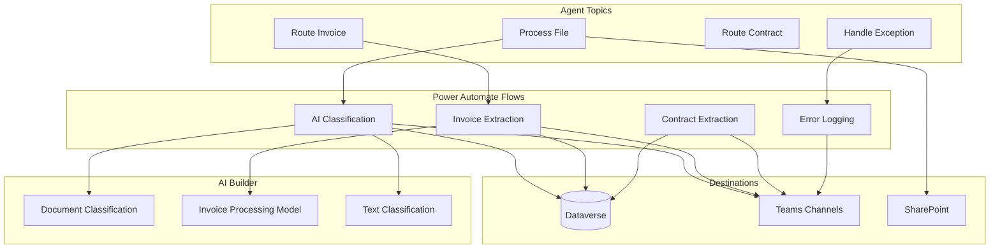
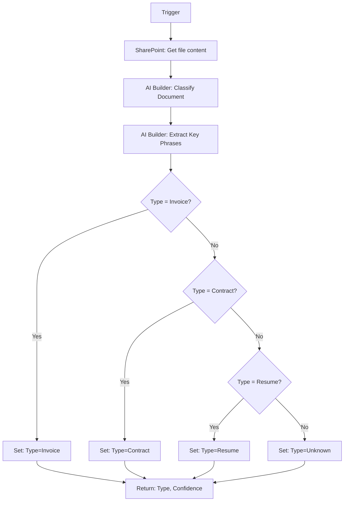
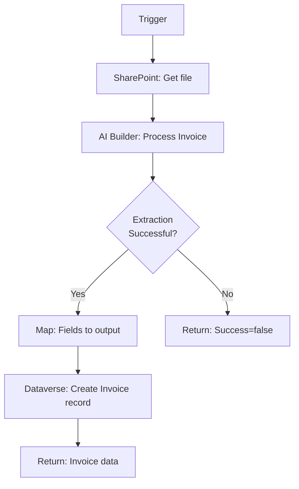
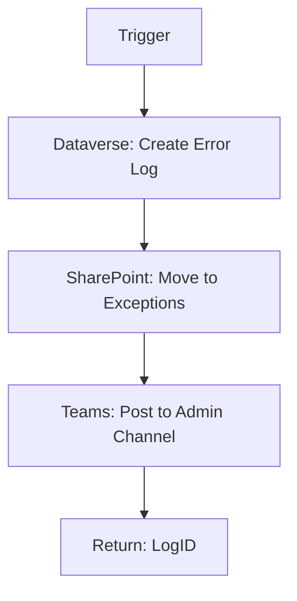

# Document Processor Agent — Actions & Flows

## Flows Architecture



## Flow 1: AI Document Classification

| Attribute | Value |
|-----------|-------|
| **Name** | DocProc-Classify |
| **Trigger** | Run a flow from Copilot |
| **Build Time** | 20 minutes |

### Parameters

**Input:**
| Parameter | Type | Required |
|-----------|------|----------|
| FileURL | String | Yes |
| FileName | String | Yes |
| LibraryID | String | Yes |

**Output:**
| Parameter | Type |
|-----------|------|
| DocumentType | String |
| Confidence | Number |
| KeyPhrases | Array |

### Flow Steps



---

## Flow 2: Invoice Field Extraction

| Attribute | Value |
|-----------|-------|
| **Name** | DocProc-ExtractInvoice |
| **Trigger** | Run a flow from Copilot |
| **Build Time** | 15 minutes |

### Parameters

**Input:**
| Parameter | Type |
|-----------|------|
| FileURL | String |

**Output:**
| Parameter | Type |
|-----------|------|
| VendorName | String |
| InvoiceNumber | String |
| Amount | Number |
| DueDate | Date |
| Success | Boolean |

### Flow Steps



---

## Flow 3: Teams Notification

| Attribute | Value |
|-----------|-------|
| **Name** | DocProc-Notify |
| **Trigger** | Run a flow from Copilot |
| **Build Time** | 10 minutes |

### Parameters

**Input:**
| Parameter | Type |
|-----------|------|
| Channel | String |
| DocumentType | String |
| FileName | String |
| Summary | String |
| FileURL | String |

### Adaptive Card Template

```json
{
  "type": "AdaptiveCard",
  "body": [
    {
      "type": "TextBlock",
      "text": "New ${DocumentType} Processed",
      "weight": "Bolder",
      "size": "Large"
    },
    {
      "type": "FactSet",
      "facts": [
        {"title": "File", "value": "${FileName}"},
        {"title": "Type", "value": "${DocumentType}"},
        {"title": "Processed", "value": "${Timestamp}"}
      ]
    },
    {
      "type": "TextBlock",
      "text": "${Summary}",
      "wrap": true
    }
  ],
  "actions": [
    {
      "type": "Action.OpenUrl",
      "title": "View Document",
      "url": "${FileURL}"
    }
  ]
}
```

---

## Flow 4: Error Logging

| Attribute | Value |
|-----------|-------|
| **Name** | DocProc-LogError |
| **Trigger** | Run a flow from Copilot |
| **Build Time** | 10 minutes |

### Flow Steps



---

## AI Builder Models

### Document Classification Model

**Type:** Custom text classification
**Categories:**
- Invoice
- Contract
- Resume
- Report
- Correspondence
- Unknown

**Training Data:** 50+ samples per category

### Invoice Processing Model

**Type:** Pre-built invoice processing
**Extracted Fields:**
- Vendor name and address
- Invoice number
- Invoice date
- Due date
- Total amount
- Line items

---

## Dataverse Tables

### Document Processing Log

| Column | Type | Description |
|--------|------|-------------|
| ProcessingID | Auto-number | DOC-#### |
| FileName | Text | Original filename |
| FileURL | URL | SharePoint link |
| DocumentType | Choice | Classification result |
| Confidence | Number | 0-100 |
| Status | Choice | Processed/Failed/Manual |
| ProcessedDate | DateTime | Completion time |
| ProcessingTime | Number | Seconds |

### Invoices

| Column | Type |
|--------|------|
| InvoiceID | Auto-number |
| VendorName | Text |
| InvoiceNumber | Text |
| Amount | Currency |
| DueDate | Date |
| Status | Choice |
| SourceDocumentURL | URL |

---

## Environment Variables

| Variable | Description |
|----------|-------------|
| IncomingLibraryID | SharePoint library GUID |
| ProcessedFolderPath | Destination for processed files |
| ExceptionsFolderPath | Destination for failed files |
| AccountingChannelID | Teams channel for invoices |
| LegalChannelID | Teams channel for contracts |
| AdminChannelID | Teams channel for exceptions |
| ConfidenceThreshold | Minimum confidence (default: 80) |
