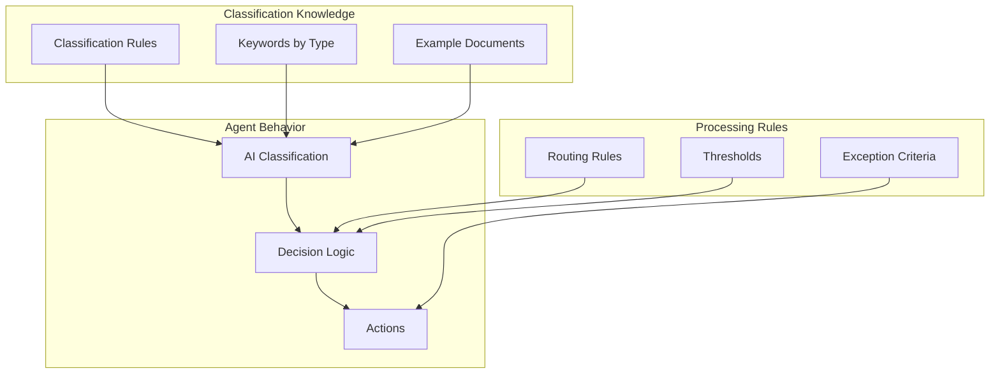

# Document Processor Agent — Knowledge Sources

## Knowledge Architecture

For autonomous agents, knowledge sources define **classification rules** and **processing guidelines** rather than conversational content.



## Classification Rules

### Document Type Definitions

| Type | Keywords | File Patterns | Confidence Boost |
|------|----------|---------------|------------------|
| Invoice | invoice, payment, due, amount, vendor | *invoice*.pdf, *inv*.pdf | +10% if "Invoice" in filename |
| Contract | agreement, parties, terms, whereas, executed | *contract*.pdf, *agreement*.docx | +10% if "Contract" in filename |
| Resume | experience, education, skills, objective | *resume*.pdf, *cv*.docx | +10% if "Resume" in filename |
| Report | summary, analysis, findings, recommendations | *report*.pdf, *analysis*.docx | None |

### Confidence Thresholds

| Threshold | Action |
|-----------|--------|
| >= 90% | Auto-route, no review needed |
| 80-89% | Auto-route, flag for spot-check |
| 60-79% | Route to manual queue, suggest type |
| < 60% | Route to manual queue, no suggestion |

## Routing Rules

### Invoice Routing

| Condition | Destination |
|-----------|-------------|
| Amount < $1,000 | Auto-process, notify AP |
| Amount $1,000-$10,000 | Auto-process, notify AP + Manager |
| Amount > $10,000 | Require approval before processing |
| Vendor = New | Flag for vendor verification |

### Contract Routing

| Condition | Destination |
|-----------|-------------|
| Type = NDA | Legal Standard Queue |
| Type = MSA | Legal Priority Queue |
| Type = Amendment | Route to original contract owner |
| Expiration < 30 days | Urgent Legal Queue |

### Resume Routing

| Condition | Destination |
|-----------|-------------|
| Keywords match open position | Route to hiring manager |
| No position match | HR General Queue |
| Executive level | HR Leadership Queue |

## Exception Handling Rules

### Auto-Exception Conditions

| Condition | Action |
|-----------|--------|
| File size > 10 MB | Move to large file queue |
| Password protected | Move to manual queue |
| Corrupted/unreadable | Log error, alert admin |
| Classification timeout | Retry once, then exception |
| Duplicate detected | Link to original, skip processing |

### Escalation Rules

| Condition | Escalation |
|-----------|------------|
| > 5 exceptions in 1 hour | Alert admin channel |
| > 20 exceptions in 24 hours | Create support ticket |
| Same file fails 3x | Permanent exception, notify owner |

## SharePoint Library Configuration

### Incoming Documents Library

```
/sites/Documents/IncomingDocuments
├── /Invoices (auto-created)
├── /Contracts (auto-created)
├── /Resumes (auto-created)
├── /Processed (completed files)
└── /Exceptions (failed files)
```

### Metadata Columns

| Column | Type | Purpose |
|--------|------|---------|
| DocumentType | Choice | Classification result |
| ProcessingStatus | Choice | New/Processing/Complete/Failed |
| Confidence | Number | Classification confidence |
| ProcessedDate | DateTime | When processed |
| RoutedTo | Text | Destination team/channel |

## Compliance Considerations

### Retention Rules

| Document Type | Retention | Archive Location |
|---------------|-----------|------------------|
| Invoices | 7 years | Finance Archive |
| Contracts | 10 years + expiration | Legal Archive |
| Resumes | 2 years | HR Archive |
| Exceptions | 90 days | Then delete |

### Data Sensitivity

| Type | Sensitivity | Handling |
|------|-------------|----------|
| Invoices | Confidential | Internal only |
| Contracts | Highly Confidential | Encrypt at rest |
| Resumes | PII | GDPR compliant handling |

## Monitoring & Alerts

### Key Metrics

| Metric | Target | Alert Threshold |
|--------|--------|-----------------|
| Processing success rate | > 95% | < 90% |
| Avg processing time | < 30 sec | > 60 sec |
| Exception rate | < 10% | > 20% |
| Classification accuracy | > 95% | < 90% |

### Alert Channels

| Severity | Channel | Notification |
|----------|---------|--------------|
| Info | #doc-processor-logs | Adaptive card |
| Warning | #doc-processor-admin | Adaptive card + mention |
| Critical | #doc-processor-admin | Adaptive card + mention + email |
