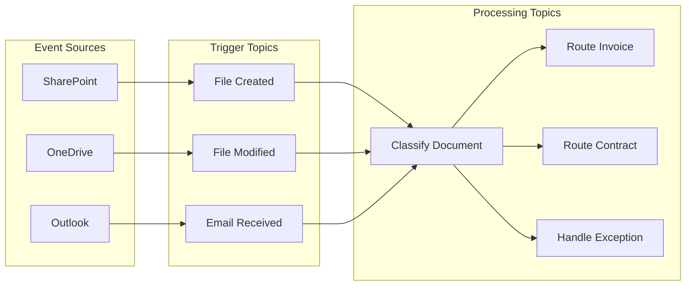
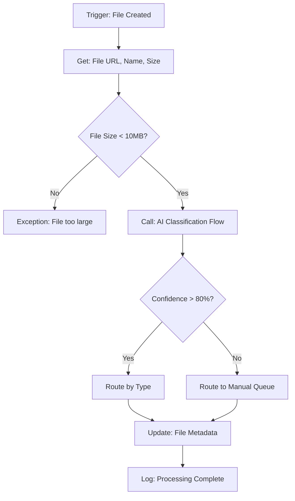
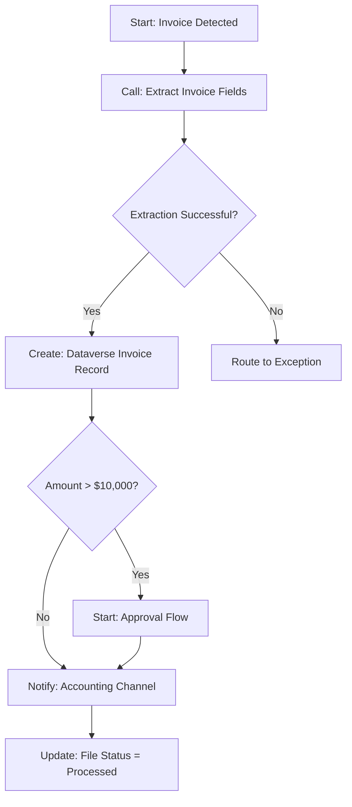
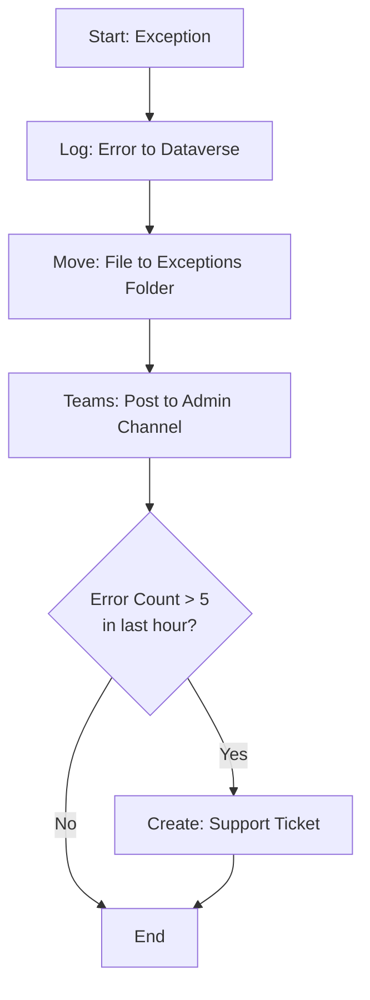

# Document Processor Agent — Topics

## Autonomous Agent Topics

Unlike conversational agents, autonomous agents use **event triggers** instead of user phrases.

## Topic Backlog

| Topic Name | Trigger Type | Key Steps | Exception Handling |
|------------|--------------|-----------|-------------------|
| Process New File | SharePoint: File Created | Get metadata, classify, route | Low confidence → Manual queue |
| Process Modified File | SharePoint: File Modified | Re-classify if needed, update records | Conflict → Flag for review |
| Process Email Attachment | Outlook: Email Received | Extract attachments, classify each | No attachment → Log and skip |
| Route Invoice | Called from classification | Extract fields, create record, notify | Extraction fail → Manual queue |
| Route Contract | Called from classification | Extract parties, assign reviewer, notify | Missing fields → Request info |
| Handle Exception | Called on error | Log error, move file, alert admin | Repeated fails → Create ticket |

## Topic: Process New File

**Trigger:** When a file is created in SharePoint

**Configuration:**
- Site: `https://contoso.sharepoint.com/sites/Documents`
- Library: `Incoming Documents`
- File types: PDF, DOCX, XLSX

**Flow:**

**Variables:**
| Name | Type | Source |
|------|------|--------|
| FileURL | URL | Trigger output |
| FileName | Text | Trigger output |
| DocumentType | Text | Classification output |
| Confidence | Number | Classification output |
| ProcessingStatus | Text | Set by topic |

## Topic: Route Invoice

**Trigger:** Called when DocumentType = "Invoice"

**Flow:**

**Extracted Fields:**
- Vendor Name
- Invoice Number
- Amount
- Due Date
- Line Items (array)

## Topic: Handle Exception

**Trigger:** Called when processing fails

**Flow:**

## Testing Scenarios

| Scenario | Test File | Expected Result |
|----------|-----------|-----------------|
| Invoice detected | Sample_Invoice.pdf | Routes to accounting, creates record |
| Contract detected | NDA_Template.docx | Routes to legal, assigns reviewer |
| Low confidence | Random_Document.pdf | Routes to manual queue |
| Large file | 15MB_Report.pdf | Exception: File too large |
| Processing error | Corrupted_File.pdf | Exception logged, admin notified |
