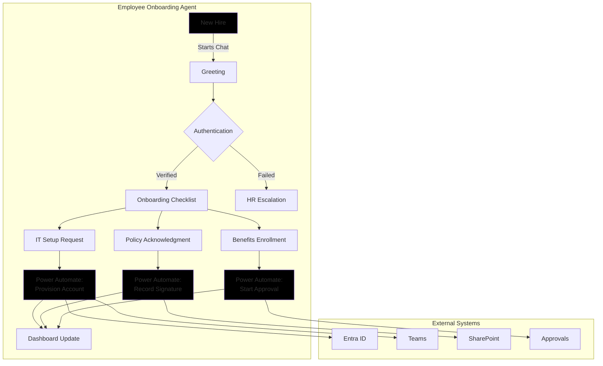
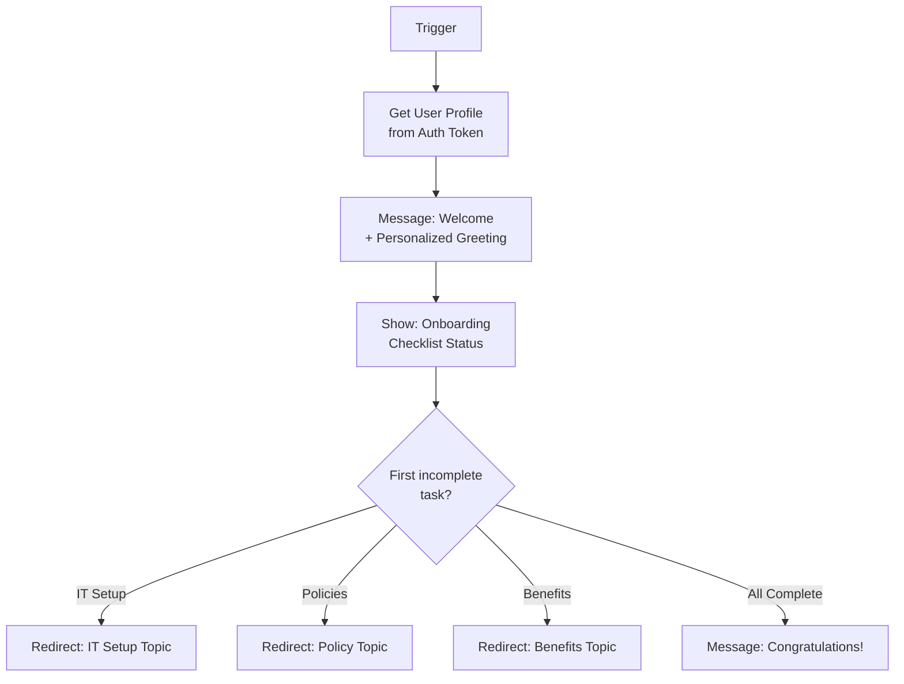

# Employee Onboarding Agent

**Course Segment:** Hour 3 — Actions, Flows & Approvals
**Difficulty:** Intermediate
**Estimated Build Time:** 45-50 minutes

## Overview

The Employee Onboarding Agent guides new hires through their first days at **Contoso**, automating HR tasks, triggering approval workflows, and providing personalized resources. This project builds on Hour 2 by adding Power Automate integration and approval flows.



## Learning Objectives

By completing this project, participants will:

1. Configure user authentication for personalized experiences
2. Create agent flows that call Power Automate
3. Implement approval workflows with the Approvals connector
4. Use variables to track multi-step processes
5. Send Teams notifications and emails from topics
6. Build adaptive card responses

## Prerequisites

- Completed Hour 2 (Customer Service Assistant)
- Power Automate access (included with M365)
- Understanding of approval concepts

---

## Scenario: Contoso New Hire Onboarding

**Business Context:** Contoso onboards 50+ new employees monthly. The current process involves:
- 12 separate emails from HR
- 3 different portals to visit
- Manual tracking in spreadsheets
- Average 5-day completion time

**Goal:** Create a conversational onboarding assistant that reduces time-to-productivity from 5 days to 2 days.

**Success Metrics:**
| Metric | Target | Measurement |
|--------|--------|-------------|
| Checklist Completion | 95%+ | % completing all steps in first week |
| Time to Completion | < 2 days | Avg time from start to finish |
| HR Escalations | < 10% | % requiring human intervention |
| Employee Satisfaction | 4.5+/5 | Post-onboarding survey |

---

## Step-by-Step Build Guide

### Phase 1: Create Agent with Authentication (10 minutes)

#### Step 1.1: Create the Agent
1. Go to [copilotstudio.microsoft.com](https://copilotstudio.microsoft.com)
2. Click **+ Create** > **New agent**
3. Describe the agent:
```
Create an employee onboarding assistant for Contoso that helps new hires
complete their onboarding checklist, access HR resources, and get IT
equipment set up. The agent should authenticate users and track their
progress through onboarding tasks.
```

#### Step 1.2: Configure Authentication
1. Go to **Settings** > **Security** > **Authentication**
2. Select **Authenticate with Microsoft**
3. Configure Microsoft Entra ID:
   - **Authentication type:** Manual
   - **Client ID:** [Your app registration]
   - **Scopes:** `User.Read`, `profile`, `openid`
4. Enable **Require users to sign in**

> **Important:** Authentication enables personalized experiences and access to user profile data. See [End-user authentication](https://learn.microsoft.com/en-us/microsoft-copilot-studio/advanced-end-user-authentication).

---

### Phase 2: Build Onboarding Topics (15 minutes)

#### Step 2.1: Welcome & Start Onboarding Topic

**Trigger phrases:**
```
Start onboarding
I'm a new employee
Begin my onboarding
New hire checklist
```

**Flow:**


#### Step 2.2: IT Setup Request Topic

**Trigger phrases:**
```
IT setup
Get my laptop
Computer request
Equipment setup
Set up my workstation
```

**Variables:**
| Variable | Type | Purpose |
|----------|------|---------|
| EmployeeEmail | Text (from auth) | User's email |
| PreferredDevice | Choice | Laptop type preference |
| StartDate | Date | Employment start date |
| SetupTicketID | Text | From Power Automate |

**Flow:**
1. Greet user by name (from auth token)
2. Ask device preference (Standard Laptop, Power User, Mac)
3. Confirm office location
4. Call Power Automate: Create IT Ticket
5. Display ticket number and expected timeline
6. Mark task complete in checklist

#### Step 2.3: Policy Acknowledgment Topic

**Trigger phrases:**
```
Company policies
Review policies
Sign policies
Policy acknowledgment
Employee handbook
```

**Flow:**
1. Show list of required policies
2. For each policy:
   - Display summary with link to full document
   - Ask for acknowledgment (Yes/No)
3. Call Power Automate: Record Signatures
4. Mark task complete

#### Step 2.4: Benefits Enrollment Topic

**Trigger phrases:**
```
Benefits enrollment
Health insurance
Sign up for benefits
401k enrollment
```

**Flow:**
1. Show benefits overview
2. Ask if ready to enroll
3. If yes: Call Power Automate to start approval workflow
4. Notify HR/Benefits team
5. Provide enrollment portal link
6. Mark task as "pending approval"

---

### Phase 3: Create Power Automate Flows (15 minutes)

#### Flow 1: Create IT Setup Ticket

| Attribute | Value |
|-----------|-------|
| **Name** | Onboard-ITSetupTicket |
| **Trigger** | Run a flow from Copilot |

**Input:** EmployeeEmail, PreferredDevice, StartDate, OfficeLocation
**Output:** TicketID, EstimatedCompletion

**Steps:**
1. Create row in IT Requests (Dataverse/SharePoint)
2. Send Teams message to IT channel
3. Send confirmation email to employee
4. Return ticket ID

#### Flow 2: Record Policy Signatures

| Attribute | Value |
|-----------|-------|
| **Name** | Onboard-RecordSignatures |
| **Trigger** | Run a flow from Copilot |

**Input:** EmployeeEmail, PolicyList (array), SignatureTimestamp
**Output:** Success, CompletionCount

**Steps:**
1. Loop through each policy
2. Create signature record in SharePoint
3. Update employee onboarding tracker
4. Return completion status

#### Flow 3: Benefits Enrollment Approval

| Attribute | Value |
|-----------|-------|
| **Name** | Onboard-BenefitsApproval |
| **Trigger** | Run a flow from Copilot |

**Input:** EmployeeEmail, EnrollmentSelections
**Output:** ApprovalID, Status

**Steps:**
1. Create approval request (Start and wait for an approval)
2. Assign to Benefits team
3. When approved: Update employee record
4. Send confirmation to employee

---

### Phase 4: Test and Deploy (10 minutes)

#### Test Scenarios
| Scenario | Steps | Expected Result |
|----------|-------|-----------------|
| New hire flow | Sign in → Start onboarding | Shows personalized checklist |
| IT request | Request laptop | Creates ticket, shows confirmation |
| Policy signing | Review & sign policies | Records signatures, updates tracker |
| Benefits | Start enrollment | Creates approval, notifies HR |

#### Publish to Teams
1. Go to **Channels** > **Microsoft Teams**
2. Enable Teams channel
3. Add to specific Teams (e.g., "New Employees" team)
4. Test with a pilot group

---

## Sample Conversation

```
Agent: Welcome to Contoso! I see you're Sarah Johnson from the Marketing team.
       I'm here to help you complete your onboarding. Let's get started!

       Your onboarding checklist:
       ☐ IT Equipment Setup
       ☐ Policy Acknowledgment (3 policies)
       ☐ Benefits Enrollment
       ☐ Team Introduction

       Would you like to start with IT Equipment Setup?

User:  Yes, let's do IT setup

Agent: Great! I'll help you request your equipment.

       What type of device do you prefer?
       1. Standard Laptop (Dell Latitude)
       2. Power User Laptop (Dell Precision)
       3. MacBook Pro

User:  Power User Laptop

Agent: Got it! I've submitted your IT request:

       Ticket #: IT-2025-1234
       Device: Dell Precision 5570
       Expected delivery: December 15, 2025

       You'll receive an email when your equipment is ready for pickup.

       ✅ IT Equipment Setup - Complete!

       Next up: Policy Acknowledgment. Ready to continue?
```

---

## Folder Contents

| Folder | Contents |
|--------|----------|
| `topics/` | Topic configurations with authentication flows |
| `actions/` | Power Automate flow definitions |
| `knowledge/` | HR policies and onboarding resources |

---

## Additional Resources

- [Agent Flows Overview](https://learn.microsoft.com/en-us/microsoft-copilot-studio/flows-overview)
- [End-User Authentication](https://learn.microsoft.com/en-us/microsoft-copilot-studio/advanced-end-user-authentication)
- [Approvals Connector](https://learn.microsoft.com/en-us/connectors/approvals/)
