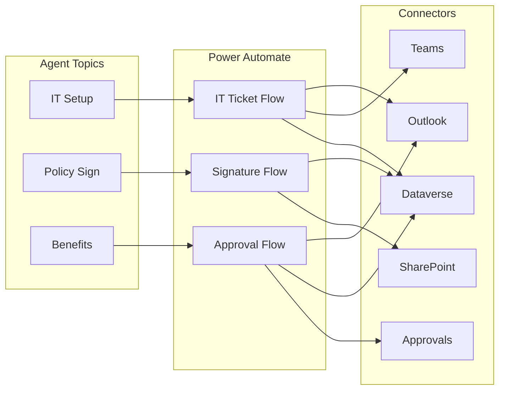
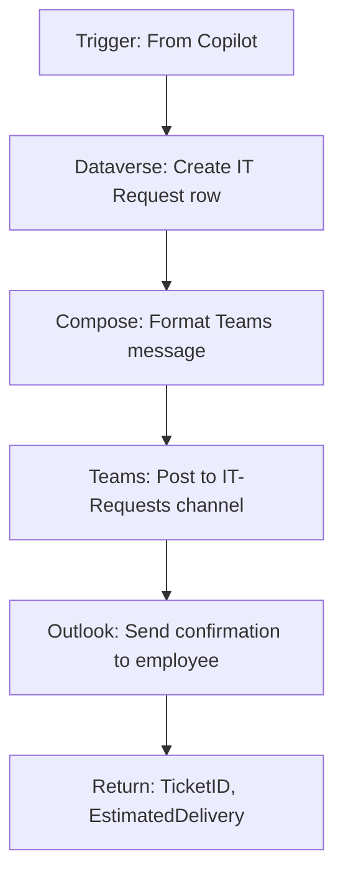
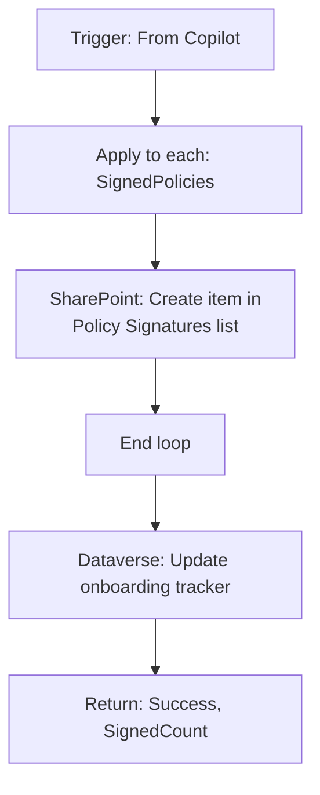
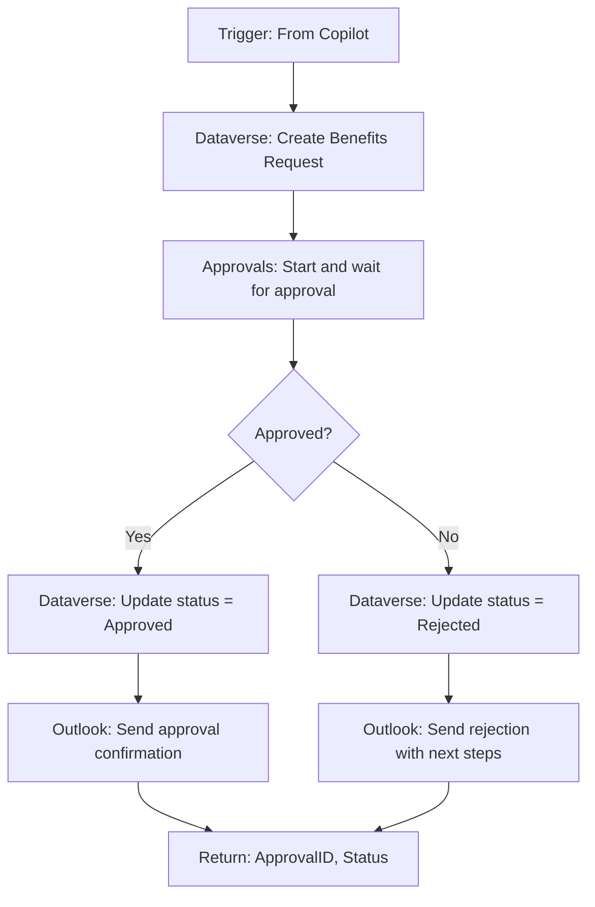

# Employee Onboarding Agent — Actions & Flows

## Flows Architecture

## Flow 1: IT Setup Ticket

| Attribute | Value |
|-----------|-------|
| **Name** | Onboard-ITSetupTicket |
| **Trigger** | Run a flow from Copilot |
| **Build Time** | 15 minutes |

### Parameters

**Input:**
| Parameter | Type | Required |
|-----------|------|----------|
| EmployeeEmail | String | Yes |
| EmployeeName | String | Yes |
| PreferredDevice | String | Yes |
| OfficeLocation | String | Yes |
| StartDate | Date | Yes |

**Output:**
| Parameter | Type |
|-----------|------|
| TicketID | String |
| EstimatedDelivery | Date |
| Success | Boolean |

### Flow Steps

### Dataverse Table: IT Requests

| Column | Type | Description |
|--------|------|-------------|
| RequestID | Auto-number | IT-YYYY-#### |
| EmployeeEmail | Text | Requestor |
| DeviceType | Choice | Standard/Power/Mac |
| Location | Text | Office |
| StartDate | Date | Need-by date |
| Status | Choice | New/In Progress/Complete |
| AssignedTo | Lookup | IT Staff |

---

## Flow 2: Record Policy Signatures

| Attribute | Value |
|-----------|-------|
| **Name** | Onboard-RecordSignatures |
| **Trigger** | Run a flow from Copilot |
| **Build Time** | 10 minutes |

### Parameters

**Input:**
| Parameter | Type | Required |
|-----------|------|----------|
| EmployeeEmail | String | Yes |
| SignedPolicies | Array | Yes |

**Output:**
| Parameter | Type |
|-----------|------|
| Success | Boolean |
| SignedCount | Integer |

### Flow Steps

### SharePoint List: Policy Signatures

| Column | Type |
|--------|------|
| Employee | Person |
| PolicyName | Text |
| SignedDate | DateTime |
| IPAddress | Text |
| ConsentGiven | Yes/No |

---

## Flow 3: Benefits Enrollment Approval

| Attribute | Value |
|-----------|-------|
| **Name** | Onboard-BenefitsApproval |
| **Trigger** | Run a flow from Copilot |
| **Build Time** | 20 minutes |

### Parameters

**Input:**
| Parameter | Type | Required |
|-----------|------|----------|
| EmployeeEmail | String | Yes |
| EmployeeName | String | Yes |
| HealthPlan | String | No |
| DentalPlan | String | No |
| RetirementContribution | Number | No |

**Output:**
| Parameter | Type |
|-----------|------|
| ApprovalID | String |
| Status | String |

### Flow Steps

### Approval Configuration

- **Type:** Approve/Reject - First to respond
- **Assigned to:** Benefits Team (group)
- **Details:** Employee name, selections, start date
- **Item link:** Link to full request in Dataverse

---

## Connection References

| Connection | Connector | Auth Type |
|------------|-----------|-----------|
| Dataverse_Onboarding | Dataverse | Service Principal |
| SharePoint_HR | SharePoint | Delegated |
| Teams_HR | Microsoft Teams | Delegated |
| Outlook_Notifications | Office 365 Outlook | Delegated |
| Approvals_Benefits | Approvals | Delegated |

## Environment Variables

| Variable | Dev | Prod |
|----------|-----|------|
| HRTeamID | dev-team-guid | prod-team-guid |
| ITChannelID | dev-channel-guid | prod-channel-guid |
| BenefitsApproverGroup | benefits-dev@contoso.com | benefits@contoso.com |

## Testing

| Flow | Test Input | Expected |
|------|------------|----------|
| IT Ticket | Valid employee, Standard Laptop | Returns TicketID |
| Signatures | 3 policies signed | Creates 3 SharePoint items |
| Benefits | Health + Dental selected | Creates approval, waits |
