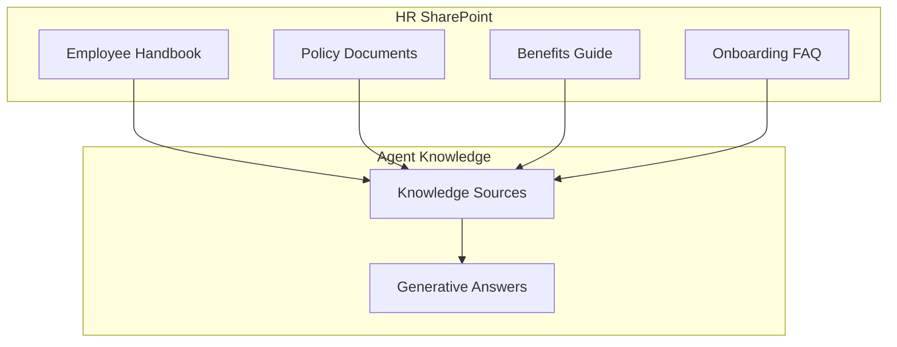

# Employee Onboarding Agent — Knowledge Sources

## Knowledge Architecture



## SharePoint Knowledge Source

| Attribute | Value |
|-----------|-------|
| **Source Type** | SharePoint Site |
| **URL** | `https://contoso.sharepoint.com/sites/HR` |
| **Refresh** | Automatic |
| **Owner** | HR Operations |

### Document Library Structure

```
/HR
├── /Onboarding
│   ├── Welcome-Guide.pdf
│   ├── First-Week-Checklist.docx
│   └── Office-Map.pdf
├── /Policies
│   ├── Employee-Handbook.pdf
│   ├── Code-of-Conduct.pdf
│   ├── IT-Acceptable-Use.pdf
│   └── Data-Privacy.pdf
├── /Benefits
│   ├── Benefits-Overview.pdf
│   ├── Health-Plans-Comparison.xlsx
│   └── 401k-Guide.pdf
└── /FAQ
    └── New-Hire-FAQ.docx
```

## Sample FAQ Content

### New Hire FAQ (New-Hire-FAQ.docx)

```markdown
# New Hire Frequently Asked Questions

## First Day

**Q: What time should I arrive on my first day?**
A: Plan to arrive at 9:00 AM. Your manager or HR buddy will meet you at reception.

**Q: What should I bring?**
A: Bring a valid ID (driver's license or passport) for I-9 verification,
   voided check for direct deposit, and any parking pass application if needed.

**Q: Where do I park?**
A: Visitor parking is available in Lot B. After receiving your badge, you'll
   get access to employee parking in Lot A.

## IT & Equipment

**Q: When will I get my laptop?**
A: Standard equipment is ready on your first day. If you requested a
   specialized device, it may take 3-5 business days.

**Q: How do I get my email set up?**
A: IT will provide your credentials on day one. Your email format is
   firstname.lastname@contoso.com.

**Q: What software will be installed?**
A: Standard suite includes Microsoft 365, Teams, company VPN, and
   department-specific applications.

## Benefits

**Q: When can I enroll in benefits?**
A: You have 30 days from your start date to complete benefits enrollment.
   Coverage begins the first of the month following enrollment.

**Q: What health plans are available?**
A: We offer three tiers:
   - Basic (lowest premium, higher deductible)
   - Standard (balanced coverage)
   - Premium (lowest deductible, highest premium)

## Policies

**Q: What policies do I need to sign?**
A: Required policies include:
   1. Employee Handbook acknowledgment
   2. Code of Conduct
   3. IT Acceptable Use Policy
   4. Data Privacy Agreement

**Q: Where can I find the full employee handbook?**
A: The handbook is available on the HR SharePoint site or through
   this onboarding assistant. Just ask "Show me the employee handbook."
```

## Knowledge Source Configuration

| Setting | Value |
|---------|-------|
| Generative answers | Enabled |
| Content moderation | Medium |
| AI General Knowledge | Disabled |
| Authentication | Required (employee data) |

## Content Categories

| Category | Use Case | Generative? |
|----------|----------|-------------|
| Onboarding FAQ | Common questions | Yes |
| Policy Summaries | Quick reference | Yes |
| Benefits Details | Plan comparisons | Yes |
| Full Policy Text | Acknowledgment | No (link only) |
| Forms | I-9, W-4, etc. | No (link only) |

## Maintenance

| Task | Frequency | Owner |
|------|-----------|-------|
| Review FAQ accuracy | Quarterly | HR |
| Update benefits info | Annually (open enrollment) | Benefits |
| Policy updates | As needed | Legal/HR |
| Link verification | Monthly | HR Ops |
