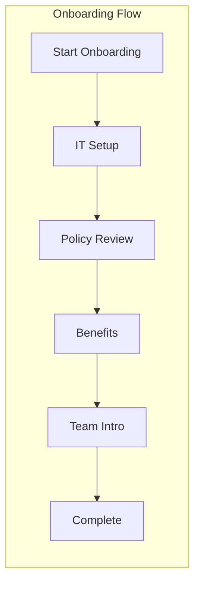
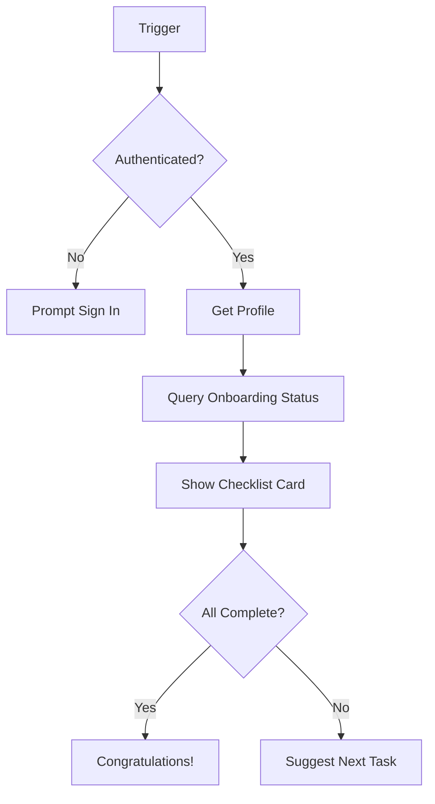
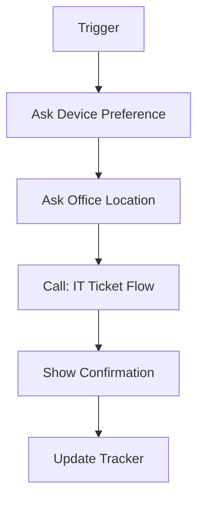
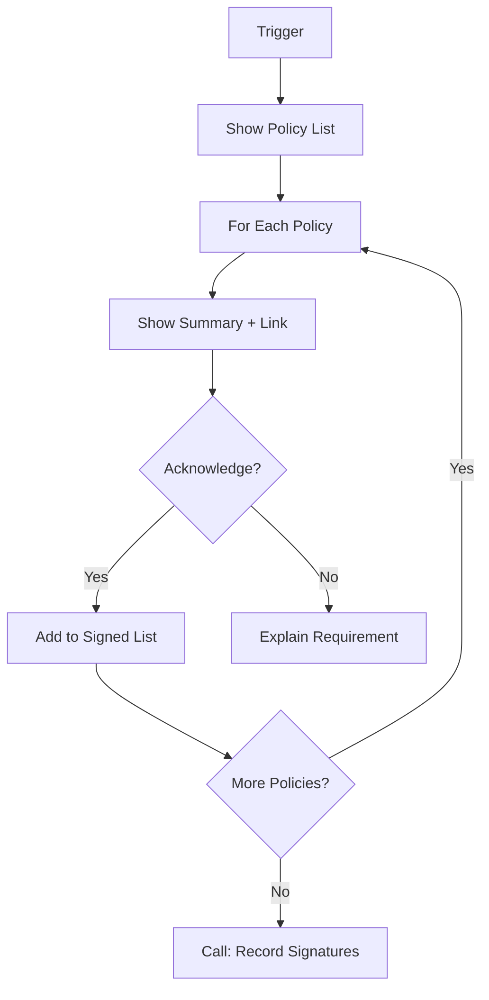

# Employee Onboarding Agent — Topics

## Topics Overview



## Topic Backlog

| Topic Name | Trigger Phrases | Key Steps | Required Variables |
|------------|-----------------|-----------|-------------------|
| Start Onboarding | "start onboarding", "new employee", "begin checklist" | Auth check, show checklist, route to first task | UserEmail, UserName, Department |
| IT Setup Request | "IT setup", "laptop request", "equipment" | Collect preferences, call flow, confirm ticket | PreferredDevice, OfficeLocation, TicketID |
| Policy Acknowledgment | "policies", "handbook", "sign policies" | Loop policies, capture signatures, record | PolicyList, SignatureTimestamp |
| Benefits Enrollment | "benefits", "health insurance", "401k" | Show options, start approval, notify HR | EnrollmentSelections, ApprovalID |
| Team Introduction | "meet team", "team intro", "who do I work with" | Get manager info, schedule meeting, share contacts | ManagerEmail, TeamChannelURL |
| Check Progress | "my progress", "checklist status", "what's left" | Query tracker, show status, suggest next | CompletionPercentage |
| HR Escalate | "talk to HR", "human help", "problem" | Capture context, notify HR, set expectations | IssueDescription, Priority |

## Authentication Configuration

**Required for personalized experience:**

```
Authentication Type: Microsoft Entra ID
Require Sign-in: Yes
Scopes: User.Read, profile, openid, email
```

**User Profile Variables (from token):**
- `System.User.DisplayName` — Full name
- `System.User.Email` — Work email
- `System.User.Id` — AAD Object ID

## Key Topic Flows

### Start Onboarding


### IT Setup Request


### Policy Acknowledgment


## Testing Checklist

| Topic | Test Case | Expected Result |
|-------|-----------|-----------------|
| Start Onboarding | New user signs in | Shows personalized checklist |
| IT Setup | Complete request | Ticket created, confirmation shown |
| Policies | Sign all policies | Records saved, status updated |
| Benefits | Start enrollment | Approval created, HR notified |

## Implemented in this repo

Blueprint topic folders:

- `T01_Day1Checklist`
- `T02_RequestAccess`
- `T03_BenefitsFAQ`

Each folder includes build steps, a YAML blueprint, and test assets.

