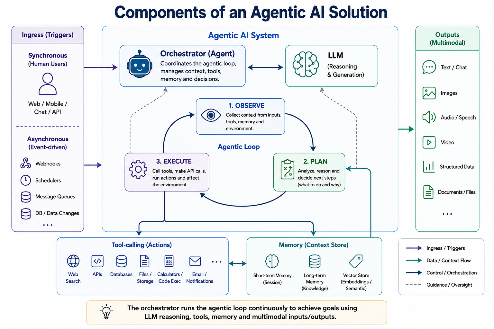

# What Is an Agent

An **agent** is an AI system that can take actions on your behalf, not just answer questions. It observes state, reasons about what to do next, and calls tools, APIs, or workflows to make changes, then checks the result and decides what to do next.

This distinction (respond vs. act) is the throughline for every platform covered in this course, from M365 Copilot agents through Copilot Studio to code-first frameworks like LangGraph and Azure AI Foundry.
